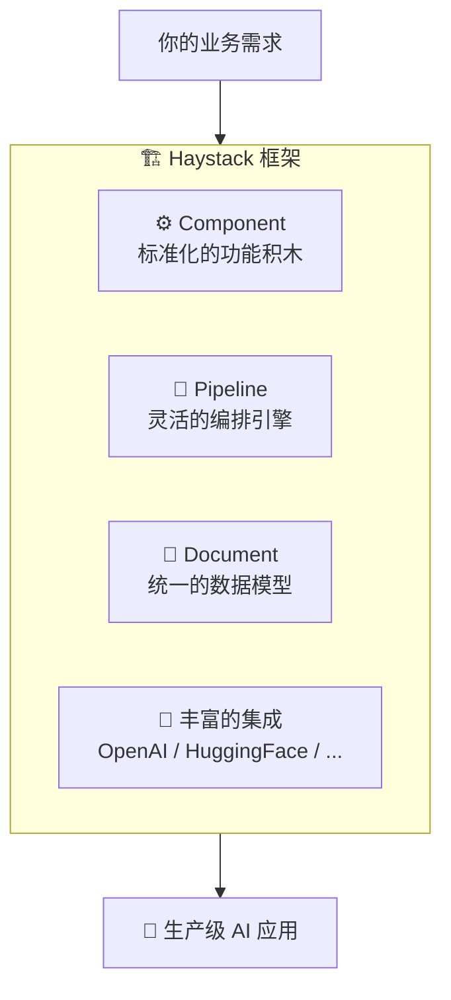
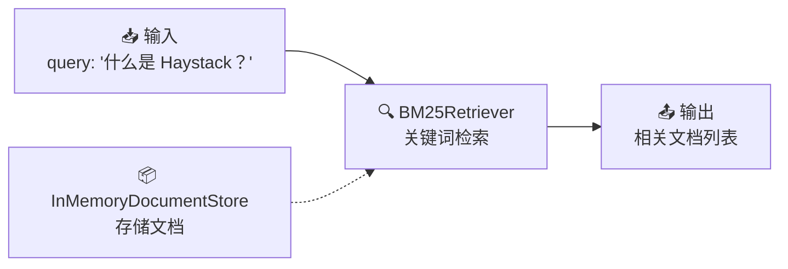

# 🚀 第1章：初识 Haystack

> 从零开始认识 Haystack，理解它为什么存在、解决了什么问题

## 📌 本章目标

- 理解 Haystack 是什么以及它要解决的问题
- 了解 Haystack 的设计哲学
- 完成安装与第一个 Hello World 程序

---

## 1.1 为什么需要 Haystack？

### 🤔 一个真实的场景

假设你是一家公司的技术负责人，CEO 给你一个任务：

> "我们有几千份内部文档，员工经常找不到需要的信息。你能不能做一个智能问答系统，员工问一个问题，系统就能从文档中找到答案？"

你开始思考实现方案：

```
1. 首先，你需要把各种格式的文档（PDF、Word、Markdown）转成统一格式
2. 然后，把文档切成小段落，方便检索
3. 接着，把段落转成向量（Embedding），存到向量数据库
4. 用户提问时，把问题也转成向量，找到最相关的段落
5. 最后，把问题和相关段落一起发给 LLM，生成回答
```

这就是经典的 **RAG（Retrieval-Augmented Generation，检索增强生成）** 架构。

### 😰 直接自己实现的痛点

如果你从头自己实现上述流程：

| 痛点 | 描述 |
|------|------|
| 🔧 大量胶水代码 | 每个步骤之间的数据转换、错误处理... |
| 🔄 切换成本高 | 想把 OpenAI 换成 Claude？改一堆代码 |
| 🏗️ 难以复用 | 相似的管道，代码很难抽象和复用 |
| 🐛 调试困难 | 哪一步出了问题？数据流很难追踪 |
| 📦 生产部署 | 序列化、可观测性、并发...都要自己处理 |

### ✅ Haystack 的解决方案

Haystack 就是为了解决这些痛点而生的。它提供：



**用一句话概括：Haystack 把构建 AI 应用所需的各种能力，封装成标准化的「积木」（Component），通过「管道」（Pipeline）把它们组装在一起。**

---

## 1.2 Haystack 的设计哲学

### 🧱 乐高积木的哲学

Haystack 的核心设计理念就像乐高积木：

```
🧱 每个积木（Component）有标准的接口
🔗 积木之间通过固定方式连接（Pipeline）
🏗️ 组合不同的积木可以构建出无数种作品（应用）
```

具体来说，Haystack 遵循以下设计原则：

#### 1️⃣ 模块化（Modular）

每个组件做且只做一件事：

```python
# ❌ 错误示范：一个函数做了太多事
def process_and_answer(file_path, question):
    text = read_file(file_path)       # 读文件
    chunks = split_text(text)          # 分块
    embeddings = embed(chunks)         # 嵌入
    relevant = search(embeddings, question)  # 搜索
    answer = generate(relevant, question)    # 生成
    return answer

# ✅ Haystack 的方式：每个组件专注一件事
pipeline.add_component("converter", TextFileToDocument())     # 只负责读文件
pipeline.add_component("splitter", DocumentSplitter())        # 只负责分块
pipeline.add_component("embedder", OpenAIDocumentEmbedder())  # 只负责嵌入
pipeline.add_component("retriever", InMemoryEmbeddingRetriever())  # 只负责检索
pipeline.add_component("generator", OpenAIChatGenerator())    # 只负责生成
```

#### 2️⃣ 声明式（Declarative）

你只需要**声明**想做什么，而不是**编码**怎么做：

```python
# 声明组件之间的连接关系
pipeline.connect("converter.documents", "splitter.documents")
pipeline.connect("splitter.documents", "embedder.documents")
pipeline.connect("embedder.documents", "writer.documents")

# Haystack 自动处理：
# - 数据格式转换
# - 执行顺序规划
# - 类型检查
# - 错误处理
```

#### 3️⃣ 厂商无关（Vendor-Agnostic）

同样的管道结构，只需替换组件就能切换供应商：

```python
# 使用 OpenAI
generator = OpenAIChatGenerator(model="gpt-4")

# 切换到 HuggingFace —— 只改这一行！
generator = HuggingFaceAPIChatGenerator(model="meta-llama/Llama-3-70b")

# 管道的其他部分完全不用改
```

#### 4️⃣ 可序列化（Serializable）

管道可以保存为 YAML/JSON，方便版本管理和部署：

```python
# 保存管道
pipeline.dump(Path("my_rag_pipeline.yaml"))

# 在另一个环境加载
loaded_pipeline = Pipeline.loads(Path("my_rag_pipeline.yaml"))
```

---

## 1.3 Haystack 2.x vs 1.x

> ⚠️ **重要**：Haystack 2.x 是对 1.x 的**完全重写**，两者不兼容。

| 特性 | Haystack 1.x | Haystack 2.x |
|------|-------------|-------------|
| 架构 | 基于 Node 的线性管道 | 基于 Component 的 DAG 管道 |
| 灵活性 | 有限的分支和路由 | 支持分支、循环、条件路由 |
| 类型安全 | 弱类型 | 强类型，编译期检查 |
| 序列化 | 有限支持 | 完整的序列化/反序列化 |
| 异步支持 | 不支持 | 原生异步支持 |
| Agent | 基础支持 | 完整的 Agent + Tool 系统 |

本教程完全基于 **Haystack 2.x** 编写。

---

## 1.4 安装与配置

> 💡 以下是面向 **Haystack 使用者** 的安装方式。如果你是 **Haystack 开发者/贡献者**，请参考 [CONTRIBUTING.md](../CONTRIBUTING.md) 使用 [Hatch](https://hatch.pypa.io/) 管理开发环境。

### 基础安装

```bash
# 基础安装（包含核心功能）
pip install haystack-ai
```

### 可选依赖

```bash
# 如果需要使用 PDF 转换
pip install "haystack-ai[pypdf]"

# 如果需要使用 Sentence Transformers（本地嵌入模型）
pip install "haystack-ai[sentence-transformers]"

# 如果需要使用 HuggingFace 本地模型
pip install "haystack-ai[huggingface]"
```

### 验证安装

```python
import haystack
print(f"Haystack 版本: {haystack.__version__}")
# 输出类似: Haystack 版本: 2.x.x
```

---

## 1.5 Hello World：你的第一个 Haystack 程序

让我们从最简单的例子开始 —— 不需要任何 API Key：

```python
from haystack import Pipeline, Document
from haystack.components.retrievers.in_memory import InMemoryBM25Retriever
from haystack.document_stores.in_memory import InMemoryDocumentStore

# 1️⃣ 创建文档存储（相当于一个小型数据库）
document_store = InMemoryDocumentStore()

# 2️⃣ 写入一些文档
documents = [
    Document(content="Python 是一种广泛使用的高级编程语言。"),
    Document(content="Java 是一种面向对象的编程语言。"),
    Document(content="Haystack 是一个用于构建 AI 应用的 Python 框架。"),
    Document(content="机器学习是人工智能的一个子领域。"),
]
document_store.write_documents(documents)

# 3️⃣ 创建管道并添加检索组件
pipeline = Pipeline()
pipeline.add_component("retriever", InMemoryBM25Retriever(document_store=document_store))

# 4️⃣ 运行管道 —— 提问！
result = pipeline.run({"retriever": {"query": "什么是 Haystack？"}})

# 5️⃣ 查看结果
for doc in result["retriever"]["documents"]:
    print(f"📄 相关度: {doc.score:.4f} | 内容: {doc.content}")
```

**运行结果：**
```
📄 相关度: 1.5000 | 内容: Haystack 是一个用于构建 AI 应用的 Python 框架。
📄 相关度: 0.0000 | 内容: Python 是一种广泛使用的高级编程语言。
...
```

### 🎯 代码解读

让我们理解上面的代码中发生了什么：



| 步骤 | 做了什么 | 类比 |
|------|----------|------|
| 创建 `InMemoryDocumentStore` | 建立文档仓库 | 建了一个图书馆 📚 |
| 写入 `Document` | 存入文档 | 把书放到书架上 📖 |
| 创建 `Pipeline` | 建立处理流程 | 设计了一条流水线 🏭 |
| 添加 `BM25Retriever` | 添加检索能力 | 雇了一个图书管理员 👨‍💼 |
| `pipeline.run()` | 执行查询 | 问图书管理员："关于 Haystack 的书在哪？" 🗣️ |

---

## 1.6 本章小结

| 知识点 | 要点 |
|--------|------|
| Haystack 是什么 | 一个开源 AI 编排框架，用于构建生产级 LLM 应用 |
| 设计哲学 | 模块化、声明式、厂商无关、可序列化 |
| 核心思想 | 像乐高一样，用标准积木（Component）通过管道（Pipeline）组装应用 |
| 安装方式 | `pip install haystack-ai` |

---

## ⏭️ 下一章预告

在下一章中，我们将鸟瞰 Haystack 的核心概念，了解 **Document**、**Component**、**Pipeline** 这三大支柱的全景关系，为后续深入学习打下基础。

[👉 第2章：核心概念总览 →](./02-core-concepts.md)
