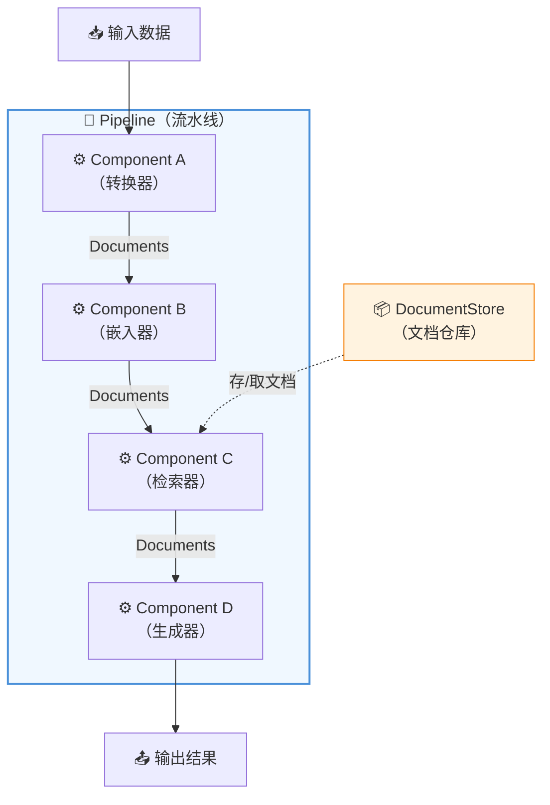
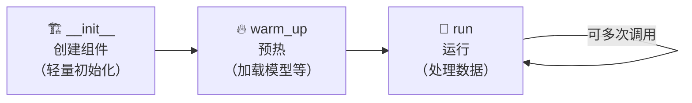
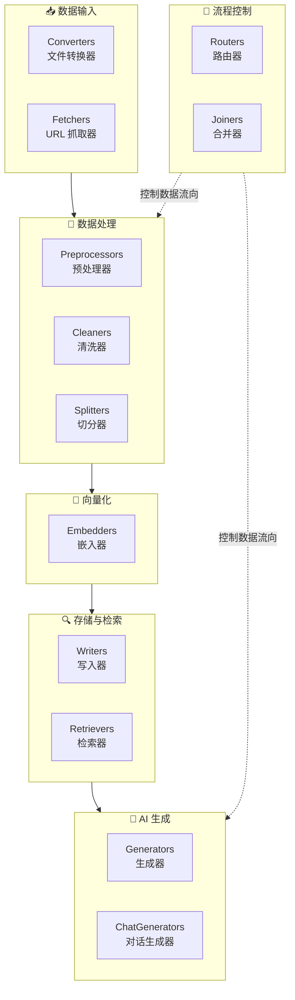
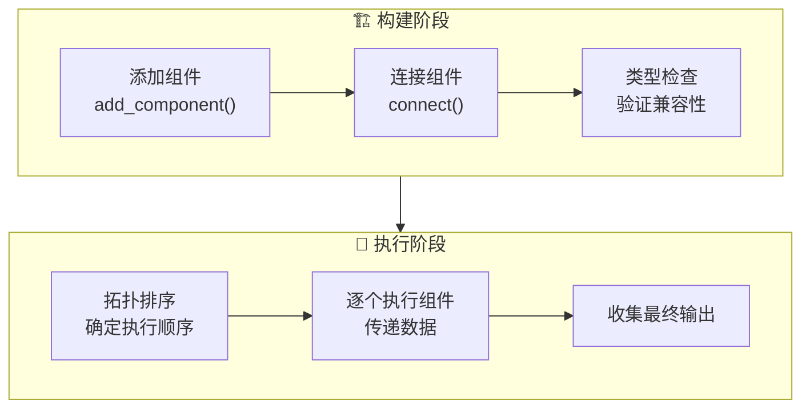
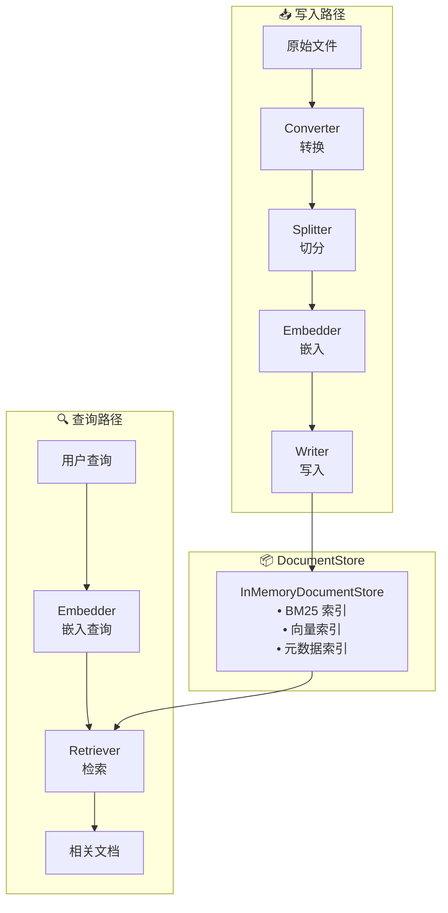
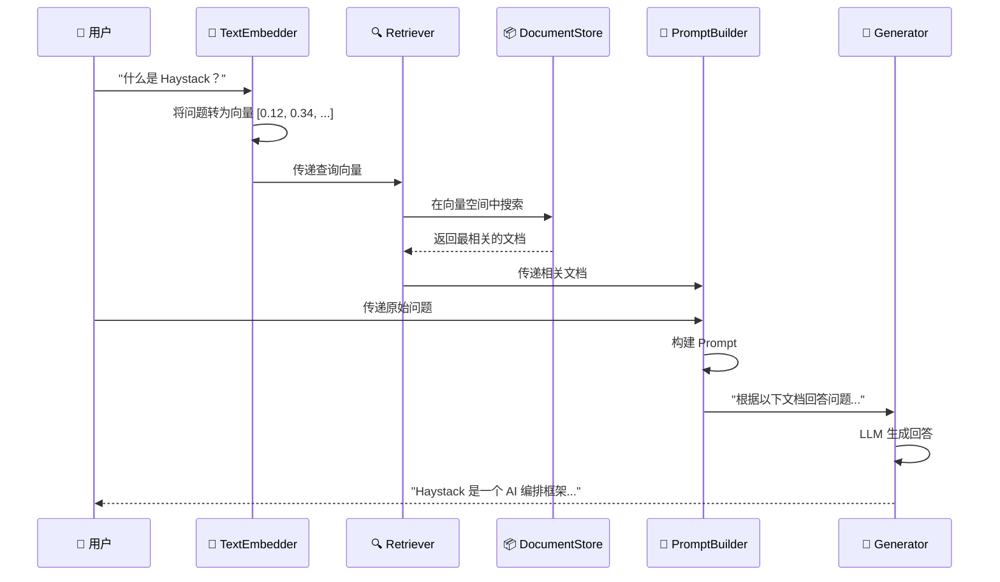
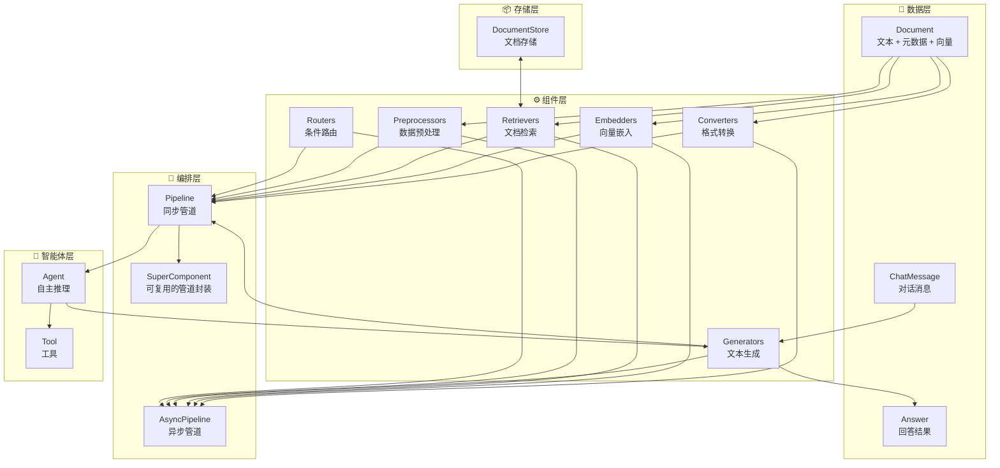

# 🧩 第2章：核心概念总览

> 鸟瞰 Haystack 的架构全景，理解三大核心抽象之间的关系

## 📌 本章目标

- 理解 Haystack 的核心架构
- 掌握 Document、Component、Pipeline 三大抽象之间的关系
- 了解数据如何在系统中流动

---

## 2.1 架构全景图

如果把 Haystack 比作一个工厂，那么：

| 概念 | 类比 | 作用 |
|------|------|------|
| **Document** 📄 | 原材料 / 产品 | 在系统中流动的数据载体 |
| **Component** ⚙️ | 工作站 / 机器 | 处理数据的功能单元 |
| **Pipeline** 🔗 | 流水线 | 把多个工作站串联起来 |
| **DocumentStore** 📦 | 仓库 | 持久化存储文档 |

它们的关系如下：



---

## 2.2 Document —— 数据的载体 📄

**Document（文档）** 是 Haystack 中最基础的数据单元。无论你的数据来自 PDF、网页还是数据库，最终都会被转换成 `Document` 对象。

### 快速预览

```python
from haystack.dataclasses import Document

doc = Document(
    content="Haystack 是一个 AI 编排框架",      # 文本内容
    meta={"source": "README.md", "page": 1},    # 元数据
)

print(doc.id)       # 自动生成的唯一 ID
print(doc.content)  # 文本内容
print(doc.meta)     # 元数据字典
```

### 为什么这样设计？

想象一下，一本书的某一页就是一个 Document：

```
📄 Document
├── content: "这一页的文字内容..."     → 正文内容
├── meta: {source: "xxx.pdf", page: 3} → 就像书脊上的信息
├── embedding: [0.1, 0.3, ...]         → 语义向量（搜索用）
├── score: 0.95                        → 相关度评分
└── id: "abc123..."                    → 唯一身份标识
```

> 📖 **详细内容请看 [第3章：Document 深度解析](./03-document.md)**

---

## 2.3 Component —— 功能的积木 ⚙️

**Component（组件）** 是 Haystack 中执行具体功能的单元。每个组件接收特定类型的输入，产生特定类型的输出。

### 快速预览

```python
from haystack import component

@component
class Greeter:
    """一个简单的问候组件"""
    
    @component.output_types(greeting=str)
    def run(self, name: str) -> dict:
        return {"greeting": f"你好，{name}！欢迎学习 Haystack！"}

# 使用组件
greeter = Greeter()
result = greeter.run(name="同学")
print(result["greeting"])  # "你好，同学！欢迎学习 Haystack！"
```

### 组件的生命周期



### 内置组件分类

Haystack 提供了丰富的内置组件，可以分为以下几大类：



> 📖 **详细内容请看 [第4章：Component 深度解析](./04-component.md)**

---

## 2.4 Pipeline —— 编排的引擎 🔗

**Pipeline（管道）** 是 Haystack 的核心编排引擎。它把多个组件连接成一个有向图（DAG），自动管理数据流转和执行顺序。

### 快速预览

```python
from haystack import Pipeline

# 1. 创建管道
pipe = Pipeline()

# 2. 添加组件
pipe.add_component("greeter", Greeter())
pipe.add_component("formatter", TextFormatter())

# 3. 连接组件
pipe.connect("greeter.greeting", "formatter.text")

# 4. 运行管道
result = pipe.run({"greeter": {"name": "小明"}})
```

### 管道的工作原理



### 管道的超能力

| 能力 | 描述 | 使用场景 |
|------|------|----------|
| 🔀 **分支** | 一个输出连接到多个组件 | 同时执行多种处理 |
| 🔄 **循环** | 支持有条件的重复执行 | Agent 的迭代推理 |
| 📊 **可视化** | 自动生成 Mermaid 图 | 调试和文档 |
| 💾 **序列化** | 保存/加载为 YAML/JSON | 部署和版本管理 |
| ⚡ **异步** | 支持 async/await | 高并发场景 |

> 📖 **详细内容请看 [第5章：Pipeline 深度解析](./05-pipeline.md)**

---

## 2.5 DocumentStore —— 文档仓库 📦

**DocumentStore（文档存储）** 是 Haystack 中管理文档持久化的组件。它像一个专门为 AI 应用优化的数据库。

### 快速预览

```python
from haystack.document_stores.in_memory import InMemoryDocumentStore
from haystack.dataclasses import Document

# 创建文档存储
store = InMemoryDocumentStore()

# 写入文档
store.write_documents([
    Document(content="Python 是最流行的编程语言之一"),
    Document(content="JavaScript 是 Web 开发的核心语言"),
])

# 按条件过滤
results = store.filter_documents(
    filters={"field": "content", "operator": "contains", "value": "Python"}
)
```

### 存储架构



### 为什么不直接用数据库？

| 普通数据库 | DocumentStore |
|-----------|---------------|
| 按字段精确查询 | 支持语义搜索（向量相似度） |
| 不理解语义 | 理解"意思相近"的查询 |
| 需要知道精确关键词 | 可以用自然语言查询 |
| 存储结构化数据 | 为文档 + 向量优化 |

---

## 2.6 数据流动：一个完整的例子

让我们看看数据在一个典型 RAG 应用中是如何流动的：



用代码表示就是：

```python
from haystack import Pipeline
from haystack.components.embedders import SentenceTransformersTextEmbedder
from haystack.components.retrievers.in_memory import InMemoryEmbeddingRetriever
from haystack.components.builders import ChatPromptBuilder
from haystack.components.generators.chat import OpenAIChatGenerator
from haystack.dataclasses import ChatMessage

# 构建 RAG 管道
rag_pipeline = Pipeline()
rag_pipeline.add_component("text_embedder", SentenceTransformersTextEmbedder())
rag_pipeline.add_component("retriever", InMemoryEmbeddingRetriever(document_store=store))
rag_pipeline.add_component("prompt_builder", ChatPromptBuilder())
rag_pipeline.add_component("generator", OpenAIChatGenerator(model="gpt-4"))

# 连接组件
rag_pipeline.connect("text_embedder.embedding", "retriever.query_embedding")
rag_pipeline.connect("retriever.documents", "prompt_builder.documents")
rag_pipeline.connect("prompt_builder.prompt", "generator.messages")

# 运行
result = rag_pipeline.run({
    "text_embedder": {"text": "什么是 Haystack？"},
    "prompt_builder": {"template": [ChatMessage.from_user(
        "根据以下文档回答问题：\n\n{{ doc.content }}\n\n\n问题：{{ question }}"
    )]},
})
```

---

## 2.7 核心概念关系图

最后，让我们用一张图来总结所有核心概念的关系：



---

## 2.8 本章小结

| 核心概念 | 一句话描述 | 类比 |
|----------|-----------|------|
| **Document** | 数据在系统中流转的标准容器 | 📦 快递包裹 |
| **Component** | 执行特定功能的处理单元 | ⚙️ 流水线上的工作站 |
| **Pipeline** | 连接组件、编排执行的引擎 | 🔗 工厂流水线 |
| **DocumentStore** | 持久化存储和检索文档的仓库 | 📚 智能图书馆 |
| **ChatMessage** | 对话格式的数据载体 | 💬 聊天消息 |
| **Answer** | 系统生成的回答结果 | 📋 答案卡片 |

---

## ⏭️ 下一章预告

下一章我们将深入 **Document** 这个核心数据模型，了解它的全部字段、使用方式、以及为什么这样设计。

[👉 第3章：Document —— 数据的载体 →](./03-document.md)
