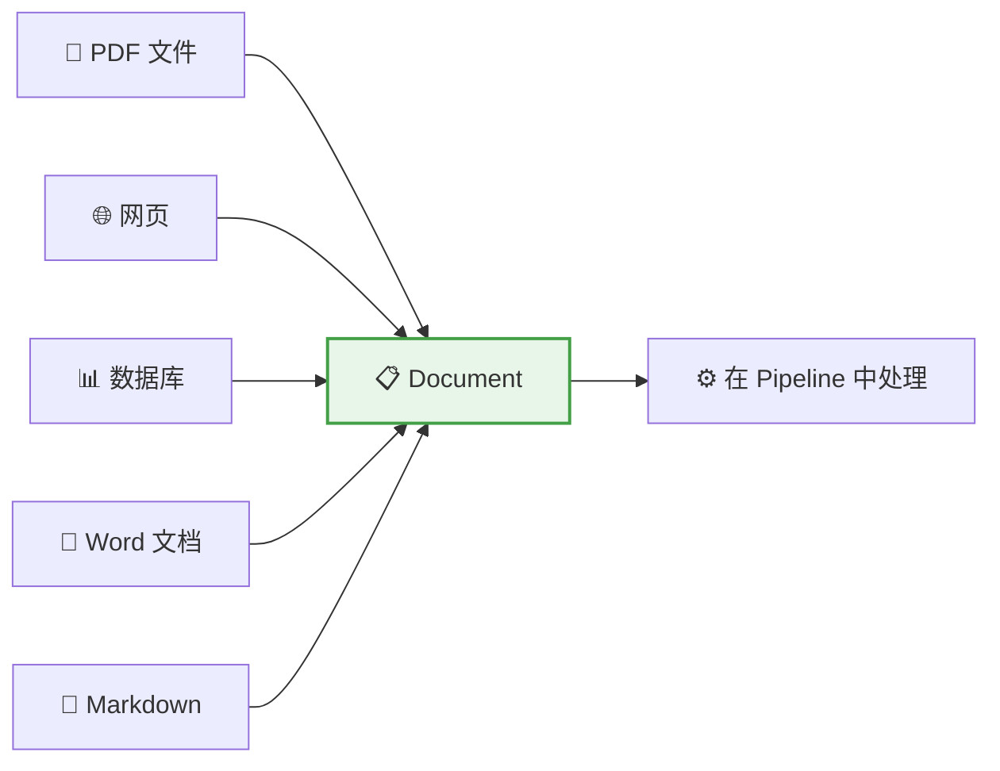
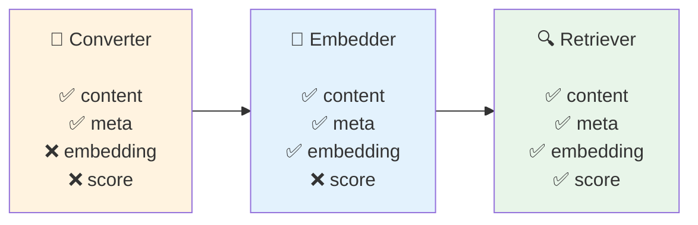
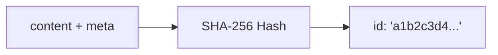

# 📄 第3章：Document —— 数据的载体

> 深入理解 Haystack 的核心数据模型，掌握文档的创建、使用和序列化

## 📌 本章目标

- 理解 Document 的完整数据结构
- 掌握文档的创建、元数据管理和序列化
- 了解相关数据类（ChatMessage、Answer 等）

---

## 3.1 什么是 Document？

在 Haystack 中，**Document（文档）** 是最基础的数据单元。不管你的数据原始格式是什么（PDF、网页、数据库记录），在 Haystack 中处理时都会被统一转换成 `Document` 对象。

### 🍕 用披萨来类比

想象你开了一家披萨店。不管客人的订单来自电话、外卖平台还是现场点餐，你都会把订单统一写到一张「订单卡」上，方便厨房处理。

`Document` 就是 Haystack 的「订单卡」—— **统一的数据格式**。



---

## 3.2 Document 的数据结构

让我们看看 `Document` 的完整字段：

```python
from haystack.dataclasses import Document

doc = Document(
    content="Haystack 是一个 AI 编排框架",    # 📝 文本内容
    meta={                                     # 📎 元数据
        "source": "readme.md",
        "page": 1,
        "author": "deepset"
    },
    embedding=[0.12, -0.34, 0.56, ...],       # 🧮 向量嵌入
    score=0.95,                                # 📊 相关度评分
    blob=None,                                 # 📦 二进制数据
)
```

### 字段详解

| 字段 | 类型 | 说明 | 何时设置 |
|------|------|------|----------|
| `id` | `str` | 唯一标识符，自动生成 | 创建时自动生成 |
| `content` | `str \| None` | 文本内容 | 转换器生成 |
| `meta` | `dict[str, Any]` | 自定义元数据 | 用户或转换器设置 |
| `embedding` | `list[float] \| None` | 密集向量表示 | Embedder 设置 |
| `sparse_embedding` | `SparseEmbedding \| None` | 稀疏向量 | BM25 等设置 |
| `score` | `float \| None` | 相关度评分 | Retriever/Ranker 设置 |
| `blob` | `ByteStream \| None` | 二进制数据（图片等） | 特殊场景 |

### 📐 数据流转中字段的变化

一个 Document 在流经不同组件时，字段会逐步被填充：



---

## 3.3 创建文档

### 方式一：直接创建

```python
from haystack.dataclasses import Document

# 最简单的方式
doc = Document(content="这是一段文本")

# 带元数据
doc = Document(
    content="Python 是最流行的编程语言之一",
    meta={
        "source": "programming_guide.pdf",
        "page": 42,
        "category": "编程语言",
        "language": "zh"
    }
)
```

### 方式二：通过转换器创建

```python
from haystack.components.converters import TextFileToDocument

converter = TextFileToDocument()
result = converter.run(sources=["my_document.txt"])
documents = result["documents"]  # List[Document]
```

### 方式三：从字典创建

```python
# 从字典反序列化
data = {
    "content": "序列化的文档内容",
    "meta": {"source": "api"},
}
doc = Document.from_dict(data)
```

---

## 3.4 文档 ID 的秘密

每个 Document 都有一个唯一的 `id`，它是如何生成的呢？

```python
doc1 = Document(content="Hello World")
doc2 = Document(content="Hello World")
doc3 = Document(content="Hello Haystack")

print(doc1.id == doc2.id)  # True  ← 相同内容，相同 ID！
print(doc1.id == doc3.id)  # False ← 不同内容，不同 ID
```

### 🔑 ID 生成原理



**为什么这样设计？**

1. **去重**：相同内容自动获得相同 ID，避免重复存储
2. **幂等性**：同一数据多次写入不会产生重复
3. **确定性**：不需要外部 ID 生成器

```python
# 你也可以手动指定 ID
doc = Document(content="自定义 ID 的文档", id="my-custom-id-001")
```

> 💡 **小贴士**：如果你需要更新文档内容但保持 ID 不变，请手动指定 `id`。

---

## 3.5 元数据（Meta）

元数据是 Document 最灵活的部分，你可以存储任何 JSON 可序列化的数据：

```python
doc = Document(
    content="深度学习是机器学习的一个分支...",
    meta={
        # 来源信息
        "source": "ai_textbook.pdf",
        "page": 15,
        "chapter": "第二章",
        
        # 分类标签
        "category": "人工智能",
        "tags": ["深度学习", "神经网络"],
        
        # 时间信息
        "created_at": "2024-01-15",
        
        # 自定义字段
        "difficulty": "中级",
        "word_count": 1500,
    }
)
```

### 元数据的妙用

#### 1️⃣ 过滤检索结果

```python
# 只检索特定分类的文档
retriever.run(
    query="什么是神经网络",
    filters={
        "operator": "AND",
        "conditions": [
            {"field": "meta.category", "operator": "==", "value": "人工智能"},
            {"field": "meta.difficulty", "operator": "==", "value": "入门"},
        ]
    }
)
```

#### 2️⃣ 排序和排名

```python
from haystack.components.rankers import MetaFieldRanker

# 按元数据字段排序
ranker = MetaFieldRanker(meta_field="created_at", ranking_mode="max")
```

#### 3️⃣ 溯源

```python
# 回答生成后，追溯原始来源
for doc in answer.documents:
    print(f"来源: {doc.meta['source']}, 第 {doc.meta['page']} 页")
```

---

## 3.6 向量嵌入（Embedding）

`embedding` 字段存储文档的**密集向量表示**。这是语义搜索的核心。

### 🎯 什么是向量嵌入？

用一个通俗的比喻来理解：

```
想象一个图书馆，传统方式是按书名首字母排列书籍。
如果你要找「如何学习编程」，你必须知道准确的书名。

现在，假设我们给每本书贴上一个「坐标标签」：
  - 《Python入门》→ [编程:0.9, 入门:0.8, 数据:0.2, ...]
  - 《机器学习实战》→ [编程:0.7, 入门:0.3, 数据:0.8, ...]

当你问「如何学习编程」时：
  你的问题向量 → [编程:0.95, 入门:0.85, 数据:0.1, ...]

系统计算距离，发现《Python入门》与你的问题最「近」！
```

### 代码示例

```python
from haystack.components.embedders import SentenceTransformersDocumentEmbedder

# 创建嵌入器
embedder = SentenceTransformersDocumentEmbedder(
    model="sentence-transformers/all-MiniLM-L6-v2"
)
embedder.warm_up()  # 加载模型

# 嵌入文档
docs = [
    Document(content="Python 是一种编程语言"),
    Document(content="猫是一种可爱的动物"),
]

result = embedder.run(documents=docs)

# 现在每个文档都有了向量
for doc in result["documents"]:
    print(f"文档: {doc.content[:20]}...")
    print(f"向量维度: {len(doc.embedding)}")
    print(f"前5个值: {doc.embedding[:5]}")
```

---

## 3.7 序列化与反序列化

Document 支持完整的序列化，方便存储和传输：

```python
doc = Document(
    content="序列化示例",
    meta={"key": "value"},
    score=0.9
)

# 序列化为字典
doc_dict = doc.to_dict()
print(doc_dict)
# {
#     "id": "abc123...",
#     "content": "序列化示例",
#     "meta": {"key": "value"},
#     "score": 0.9,
#     "embedding": None,
#     ...
# }

# 从字典反序列化
restored_doc = Document.from_dict(doc_dict)
assert restored_doc == doc  # ✅ 完全相同
```

### 扁平化模式

```python
# 默认模式：meta 作为嵌套字典
doc.to_dict(flatten=False)
# {"content": "...", "meta": {"source": "file.txt"}}

# 扁平化模式：meta 展开到顶层
doc.to_dict(flatten=True)
# {"content": "...", "source": "file.txt"}
```

> 💡 扁平化模式主要用于兼容 Haystack 1.x 的数据格式。

---

## 3.8 其他核心数据类

除了 Document，Haystack 还有几个重要的数据类：

### ChatMessage —— 对话消息 💬

```python
from haystack.dataclasses import ChatMessage

# 不同角色的消息
system_msg = ChatMessage.from_system("你是一个友好的助手")
user_msg = ChatMessage.from_user("什么是 Haystack？")
assistant_msg = ChatMessage.from_assistant("Haystack 是一个 AI 框架...")
```

**角色说明**：

| 角色 | 说明 | 类比 |
|------|------|------|
| `SYSTEM` | 系统指令，设定 AI 的行为 | 给 AI 的「工作说明书」 |
| `USER` | 用户的输入消息 | 你说的话 |
| `ASSISTANT` | AI 的回复消息 | AI 说的话 |
| `TOOL` | 工具调用结果 | 工具的返回值 |

### Answer —— 回答结果 📋

```python
from haystack.dataclasses import GeneratedAnswer

answer = GeneratedAnswer(
    data="Haystack 是一个 AI 编排框架",
    query="什么是 Haystack？",
    documents=[doc1, doc2],  # 参考的原始文档
    meta={"model": "gpt-4"}
)
```

### ByteStream —— 二进制数据 📦

```python
from haystack.dataclasses import ByteStream

# 用于处理图片、音频等二进制数据
stream = ByteStream(data=b"raw bytes...", mime_type="image/png")
```

### StreamingChunk —— 流式输出块 🌊

```python
from haystack.dataclasses import StreamingChunk

# 用于 LLM 的流式输出
chunk = StreamingChunk(content="正在", meta={"index": 0})
```

---

## 3.9 实战：文档的完整生命周期

让我们看一个完整的例子，展示文档从创建到查询的全过程：

```python
from haystack import Pipeline, Document
from haystack.document_stores.in_memory import InMemoryDocumentStore
from haystack.components.preprocessors import DocumentSplitter
from haystack.components.writers import DocumentWriter
from haystack.components.retrievers.in_memory import InMemoryBM25Retriever

# === 📥 阶段一：准备文档 ===
raw_doc = Document(
    content="""
    Python 是由 Guido van Rossum 于1991年创建的编程语言。
    它以简洁和可读性著称。Python 支持多种编程范式，
    包括面向对象、函数式和过程式编程。
    Python 广泛应用于 Web 开发、数据科学、人工智能等领域。
    """,
    meta={"source": "python_intro.txt", "language": "zh"}
)

# === ✂️ 阶段二：切分文档 ===
splitter = DocumentSplitter(split_by="sentence", split_length=2)
split_result = splitter.run(documents=[raw_doc])
print(f"切分为 {len(split_result['documents'])} 个片段")

for i, doc in enumerate(split_result["documents"]):
    print(f"  片段 {i+1}: {doc.content[:50]}...")
    print(f"  元数据: {doc.meta}")  # 🔑 元数据被继承了！

# === 💾 阶段三：存入 DocumentStore ===
store = InMemoryDocumentStore()
writer = DocumentWriter(document_store=store)
writer.run(documents=split_result["documents"])
print(f"已存入 {store.count_documents()} 个文档")

# === 🔍 阶段四：检索 ===
retriever = InMemoryBM25Retriever(document_store=store)
query_result = retriever.run(query="Python 是什么时候创建的？", top_k=2)

for doc in query_result["documents"]:
    print(f"📄 得分: {doc.score:.4f}")
    print(f"   内容: {doc.content}")
    print(f"   来源: {doc.meta['source']}")
```

---

## 3.10 本章小结

| 知识点 | 要点 |
|--------|------|
| Document 的作用 | Haystack 中统一的数据载体，承载文本、向量、元数据 |
| ID 生成机制 | 基于 content + meta 的 SHA-256 哈希，保证去重 |
| 元数据 | 灵活的 key-value 字典，支持过滤、排序、溯源 |
| 向量嵌入 | 文档的语义向量表示，是语义搜索的基础 |
| 数据流转 | Document 在 Pipeline 中流过不同组件，字段逐步被填充 |
| 其他数据类 | ChatMessage（对话）、Answer（回答）、ByteStream（二进制） |

---

## ⏭️ 下一章预告

理解了数据载体 Document 之后，下一章我们将深入 **Component** —— Haystack 的功能积木，学习如何创建自己的组件。

[👉 第4章：Component —— 功能的积木 →](./04-component.md)
