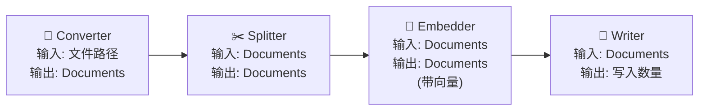
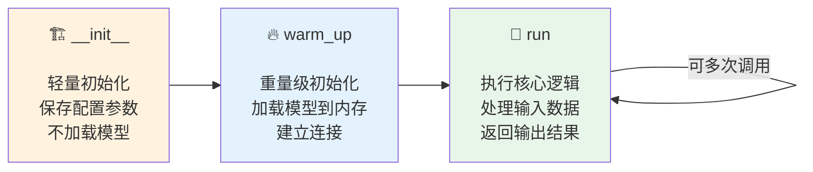
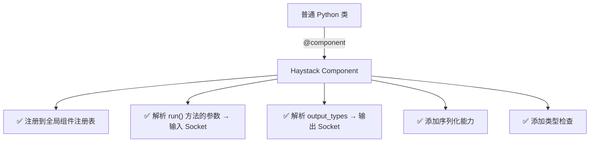
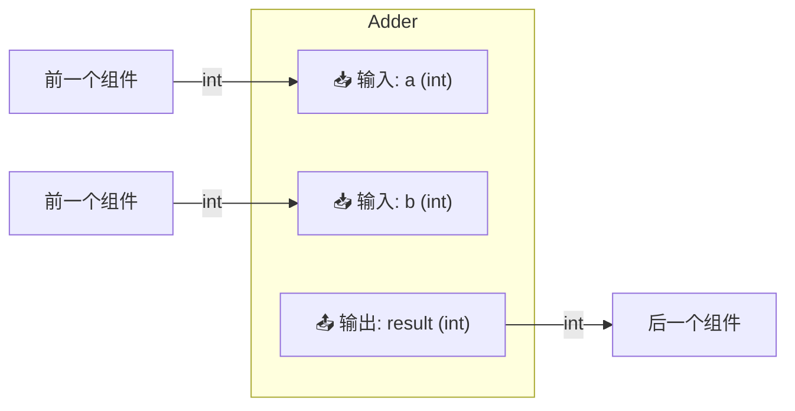
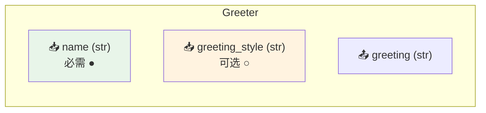
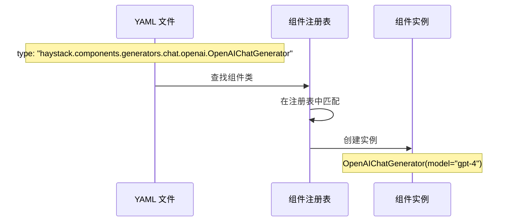

# ⚙️ 第4章：Component —— 功能的积木

> 深入理解 Haystack 的组件系统，从使用内置组件到创建自己的组件

## 📌 本章目标

- 理解 Component 的设计原理和生命周期
- 掌握 `@component` 装饰器的工作机制
- 学会创建自定义组件
- 了解输入输出 Socket 系统

---

## 4.1 什么是 Component？

**Component（组件）** 是 Haystack 中最核心的概念之一。每个组件就像流水线上的一个工作站 —— 接收输入，执行任务，产出结果。

### 🏭 工厂流水线类比

```
想象一家巧克力工厂的流水线：

  🥛 原料站 → 🔥 加热站 → 🍫 成型站 → 📦 包装站
  （接收可可豆） （融化巧克力） （倒入模具） （包装成品）

每个工作站（Component）都：
1. 有明确的输入（接收什么）
2. 有明确的输出（产出什么）  
3. 专注做一件事
4. 可以被替换（换一个新的成型站）
```

在 Haystack 中：



---

## 4.2 Component 的生命周期

一个组件从创建到运行，经历三个阶段：



### 为什么要分三个阶段？

这个设计背后有深思熟虑的理由：

| 阶段 | 做什么 | 为什么 |
|------|--------|--------|
| `__init__` | 保存配置参数 | 创建组件可能频繁发生（反序列化时），必须快 |
| `warm_up` | 加载模型/资源 | 模型可能有几个 GB，只在真正需要时加载一次 |
| `run` | 处理数据 | 核心业务逻辑，可被多次调用 |

```python
# 反例：如果在 __init__ 中加载模型
class BadEmbedder:
    def __init__(self):
        self.model = load_huge_model()  # ❌ 3GB 模型，每次创建都要加载！

# 正确做法
@component
class GoodEmbedder:
    def __init__(self, model_name: str = "all-MiniLM-L6-v2"):
        self.model_name = model_name  # ✅ 只保存配置
        self.model = None
    
    def warm_up(self):
        self.model = load_huge_model(self.model_name)  # ✅ 需要时才加载
    
    @component.output_types(embeddings=list)
    def run(self, texts: list[str]) -> dict:
        return {"embeddings": self.model.encode(texts)}  # ✅ 处理数据
```

---

## 4.3 `@component` 装饰器解析

`@component` 是让一个普通的 Python 类变成 Haystack 组件的「魔法装饰器」。

### 它做了什么？



### 基本用法

```python
from haystack import component

@component
class TextLengthCalculator:
    """计算文本长度的组件"""
    
    # 1️⃣ 声明输出类型
    @component.output_types(length=int, is_long=bool)
    def run(self, text: str, threshold: int = 100) -> dict:
        """
        参数 text 和 threshold 会自动变成输入 Socket
        返回的 dict 中的 key 对应输出 Socket
        """
        length = len(text)
        return {
            "length": length,
            "is_long": length > threshold
        }
```

### 关键规则

| 规则 | 说明 | 示例 |
|------|------|------|
| 必须有 `run()` 方法 | 这是组件的核心执行逻辑 | `def run(self, ...)` |
| `run()` 必须返回 `dict` | Key 对应输出 Socket 名称 | `return {"output": value}` |
| 必须声明输出类型 | 用 `@component.output_types()` | `@component.output_types(output=str)` |
| `run()` 的参数即输入 | 参数名 = 输入 Socket 名 | `def run(self, text: str)` |
| `__init__` 参数必须可序列化 | 用于保存/加载管道 | `str`, `int`, `list`, `dict` 等 |

---

## 4.4 输入输出 Socket 系统

**Socket（插口）** 是组件之间传递数据的接口。就像电器的插头和插座必须匹配一样。

### 🔌 插头插座的类比

```
                ┌─────────────┐
  输入 Socket → │   Component  │ → 输出 Socket
  （插座）      │   (电器)     │   （插头）
                └─────────────┘
                
  插座的形状决定了能插什么类型的插头
  即：输入类型必须与连接的输出类型兼容
```

### 在代码中

```python
@component
class Adder:
    @component.output_types(result=int)  # 输出 Socket: result (int 类型)
    def run(self, a: int, b: int) -> dict:  # 输入 Socket: a (int), b (int)
        return {"result": a + b}
```

这个组件的 Socket 结构：



### 可选输入

```python
@component
class Greeter:
    @component.output_types(greeting=str)
    def run(
        self, 
        name: str,                          # 必需输入
        greeting_style: str = "formal"      # 可选输入（有默认值）
    ) -> dict:
        if greeting_style == "formal":
            return {"greeting": f"尊敬的 {name}，您好！"}
        return {"greeting": f"嘿，{name}！"}
```



### 类型兼容性

Haystack 在连接组件时会自动检查类型兼容性，还会进行一些智能转换：

```python
# ✅ 自动类型转换
# 如果输出是 str，输入是 list[str]，Haystack 会自动把 str 包装成 [str]
pipeline.connect("component_a.text", "component_b.texts")  # str → list[str] ✅

# ❌ 不兼容的类型
pipeline.connect("component_a.number", "component_b.text")  # int → str ❌ 会报错
```

---

## 4.5 创建自定义组件

### 示例一：简单的文本处理器

```python
from haystack import component, Document

@component
class TextUpperCase:
    """将文档内容转为大写"""
    
    @component.output_types(documents=list[Document])
    def run(self, documents: list[Document]) -> dict:
        result = []
        for doc in documents:
            # 创建新文档而不是修改原文档
            new_doc = Document(
                content=doc.content.upper() if doc.content else None,
                meta=doc.meta
            )
            result.append(new_doc)
        return {"documents": result}

# 使用
processor = TextUpperCase()
result = processor.run(documents=[
    Document(content="hello world"),
    Document(content="haystack is great")
])
print(result["documents"][0].content)  # "HELLO WORLD"
```

### 示例二：带配置的组件

```python
@component
class KeywordFilter:
    """按关键词过滤文档"""
    
    def __init__(self, keywords: list[str], mode: str = "include"):
        """
        :param keywords: 关键词列表
        :param mode: "include"（包含关键词的文档）或 "exclude"（排除）
        """
        self.keywords = keywords
        self.mode = mode
    
    @component.output_types(
        filtered=list[Document],    # 通过过滤的文档
        rejected=list[Document]     # 被拒绝的文档
    )
    def run(self, documents: list[Document]) -> dict:
        filtered, rejected = [], []
        
        for doc in documents:
            has_keyword = any(kw in (doc.content or "") for kw in self.keywords)
            
            if (self.mode == "include" and has_keyword) or \
               (self.mode == "exclude" and not has_keyword):
                filtered.append(doc)
            else:
                rejected.append(doc)
        
        return {"filtered": filtered, "rejected": rejected}

# 使用
filter_comp = KeywordFilter(keywords=["Python", "AI"], mode="include")
result = filter_comp.run(documents=[
    Document(content="Python 是最好的语言"),
    Document(content="Java 也很不错"),
    Document(content="AI 改变世界"),
])
print(f"通过: {len(result['filtered'])} 个")   # 2
print(f"拒绝: {len(result['rejected'])} 个")  # 1
```

### 示例三：带预热的组件

```python
@component
class SentimentAnalyzer:
    """情感分析组件"""
    
    def __init__(self, model_name: str = "distilbert-base-uncased"):
        self.model_name = model_name
        self.classifier = None  # 不在 __init__ 中加载！
    
    def warm_up(self):
        """加载模型（只调用一次）"""
        from transformers import pipeline
        self.classifier = pipeline("sentiment-analysis", model=self.model_name)
    
    @component.output_types(
        documents=list[Document],
        sentiments=list[dict]
    )
    def run(self, documents: list[Document]) -> dict:
        if self.classifier is None:
            raise RuntimeError("请先调用 warm_up()")
        
        sentiments = []
        for doc in documents:
            result = self.classifier(doc.content)
            sentiments.append(result[0])
            # 把情感结果存入元数据
            doc.meta["sentiment"] = result[0]
        
        return {"documents": documents, "sentiments": sentiments}
```

### 示例四：支持异步的组件

```python
import asyncio

@component
class AsyncFetcher:
    """异步获取 URL 内容"""
    
    @component.output_types(content=str)
    def run(self, url: str) -> dict:
        # 同步版本
        import urllib.request
        response = urllib.request.urlopen(url)
        return {"content": response.read().decode()}
    
    @component.output_types(content=str)
    async def run_async(self, url: str) -> dict:
        # 异步版本 —— 签名必须与 run() 完全一致！
        import aiohttp
        async with aiohttp.ClientSession() as session:
            async with session.get(url) as response:
                content = await response.text()
        return {"content": content}
```

---

## 4.6 组件的序列化

组件支持自动序列化，这使得管道可以被保存和加载：

```python
@component
class Multiplier:
    def __init__(self, factor: int = 2):
        self.factor = factor
    
    @component.output_types(result=int)
    def run(self, number: int) -> dict:
        return {"result": number * self.factor}

# 序列化
comp = Multiplier(factor=3)

from haystack.core.serialization import default_to_dict, default_from_dict

# 转为字典
comp_dict = default_to_dict(comp, factor=comp.factor)
print(comp_dict)
# {
#     "type": "__main__.Multiplier",
#     "init_parameters": {"factor": 3}
# }

# 从字典恢复
restored = default_from_dict(Multiplier, comp_dict)
assert restored.factor == 3  # ✅
```

### 自定义序列化

有时默认的序列化不够用，你可以自定义：

```python
@component
class DatabaseConnector:
    def __init__(self, host: str, port: int, password: str):
        self.host = host
        self.port = port
        self.password = password  # 敏感信息！
    
    def to_dict(self) -> dict:
        """自定义序列化：不保存密码"""
        return {
            "type": "DatabaseConnector",
            "init_parameters": {
                "host": self.host,
                "port": self.port,
                # password 不序列化，从环境变量读取
            }
        }
    
    @classmethod
    def from_dict(cls, data: dict) -> "DatabaseConnector":
        """自定义反序列化：从环境变量读密码"""
        import os
        params = data["init_parameters"]
        params["password"] = os.environ.get("DB_PASSWORD", "")
        return cls(**params)
```

---

## 4.7 内置组件速览

Haystack 提供了大量内置组件，下面是按类别的速览：

### 📥 转换器（Converters）

| 组件 | 作用 | 输入 → 输出 |
|------|------|------------|
| `TextFileToDocument` | 文本文件转文档 | 文件路径 → Documents |
| `PyPDFToDocument` | PDF 转文档 | PDF 路径 → Documents |
| `HTMLToDocument` | HTML 转文档 | HTML → Documents |
| `MarkdownToDocument` | Markdown 转文档 | MD 文件 → Documents |
| `DOCXToDocument` | Word 转文档 | DOCX → Documents |

### ✂️ 预处理器（Preprocessors）

| 组件 | 作用 |
|------|------|
| `DocumentSplitter` | 按句子/单词/页面切分文档 |
| `DocumentCleaner` | 清理文档中的特殊字符 |
| `TextCleaner` | 清理文本字符串 |

### 🧮 嵌入器（Embedders）

| 组件 | 作用 |
|------|------|
| `SentenceTransformersDocumentEmbedder` | 为文档生成向量（本地模型） |
| `SentenceTransformersTextEmbedder` | 为查询文本生成向量（本地模型） |
| `OpenAIDocumentEmbedder` | 使用 OpenAI API 嵌入文档 |
| `OpenAITextEmbedder` | 使用 OpenAI API 嵌入文本 |

### 🔍 检索器（Retrievers）

| 组件 | 作用 |
|------|------|
| `InMemoryBM25Retriever` | 基于 BM25 的关键词检索 |
| `InMemoryEmbeddingRetriever` | 基于向量的语义检索 |

### 🤖 生成器（Generators）

| 组件 | 作用 |
|------|------|
| `OpenAIChatGenerator` | OpenAI 对话生成 |
| `HuggingFaceLocalChatGenerator` | 本地 HuggingFace 模型 |
| `HuggingFaceAPIChatGenerator` | HuggingFace API |

### 🔀 路由器和合并器

| 组件 | 作用 |
|------|------|
| `FileTypeRouter` | 按文件类型路由 |
| `ConditionalRouter` | 按条件路由 |
| `DocumentJoiner` | 合并多个文档列表 |

---

## 4.8 组件注册表

所有用 `@component` 装饰的类都会自动注册到全局注册表中。这在序列化和反序列化时非常重要：

```python
from haystack.core.component import Component

# 查看已注册的组件
print(Component.registry)

# 手动查找组件类
cls = Component.registry["haystack.components.converters.txt.TextFileToDocument"]
```

### 注册表的作用



---

## 4.9 实战：构建一个自定义翻译组件

让我们结合所学知识，创建一个实用的翻译组件：

```python
from haystack import component, Document, Pipeline
from haystack.components.retrievers.in_memory import InMemoryBM25Retriever
from haystack.document_stores.in_memory import InMemoryDocumentStore

@component
class SimpleTranslator:
    """简单的词典翻译组件（示例用途）"""
    
    def __init__(self, dictionary: dict[str, str] | None = None):
        self.dictionary = dictionary or {
            "hello": "你好",
            "world": "世界",
            "python": "蟒蛇（编程语言）",
            "haystack": "干草堆（AI 框架）",
        }
    
    @component.output_types(translated=str, found_words=list)
    def run(self, text: str) -> dict:
        words = text.lower().split()
        found = []
        translated_words = []
        
        for word in words:
            if word in self.dictionary:
                translated_words.append(self.dictionary[word])
                found.append(word)
            else:
                translated_words.append(word)
        
        return {
            "translated": " ".join(translated_words),
            "found_words": found
        }

# === 使用自定义组件 ===

# 单独使用
translator = SimpleTranslator()
result = translator.run(text="Hello World")
print(result)
# {"translated": "你好 世界", "found_words": ["hello", "world"]}

# 在管道中使用
store = InMemoryDocumentStore()
store.write_documents([
    Document(content="hello world from python"),
    Document(content="haystack is a great framework"),
])

pipe = Pipeline()
pipe.add_component("retriever", InMemoryBM25Retriever(document_store=store))
pipe.add_component("translator", SimpleTranslator())

# 这里需要手动连接或在 run 时传数据
# 因为 retriever 输出 documents，translator 输入 text
# 类型不直接兼容，需要一个中间转换组件
```

---

## 4.10 本章小结

| 知识点 | 要点 |
|--------|------|
| Component 是什么 | Pipeline 中执行具体功能的标准化单元 |
| 生命周期 | `__init__`（配置）→ `warm_up`（加载）→ `run`（执行） |
| `@component` 装饰器 | 自动注册、解析 Socket、添加序列化能力 |
| Socket 系统 | 输入/输出类型检查，确保组件间数据兼容 |
| 自定义组件 | 实现 `run()` 方法 + `@component.output_types()` |
| 序列化 | `to_dict()` / `from_dict()` 支持管道持久化 |

### ⚠️ 常见陷阱

1. **不要在 `__init__` 中加载大模型** → 使用 `warm_up()`
2. **`run()` 必须返回 `dict`** → 不能直接返回值
3. **输出 key 必须与 `output_types` 声明一致** → 否则运行时报错
4. **`__init__` 参数必须可序列化** → 不能传入不可序列化的对象

---

## ⏭️ 下一章预告

有了组件这些积木，下一章我们将学习如何用 **Pipeline** 把它们组装在一起，构建完整的数据处理流程。

[👉 第5章：Pipeline —— 编排的引擎 →](./05-pipeline.md)
