# 🔗 第5章：Pipeline —— 编排的引擎

> 深入理解 Haystack 的管道系统，掌握组件连接、执行原理和高级用法

## 📌 本章目标

- 理解 Pipeline 的工作原理和执行机制
- 掌握组件的添加、连接和运行
- 学会使用分支、路由等高级功能
- 了解管道的序列化和可视化

---

## 5.1 Pipeline 是什么？

**Pipeline（管道）** 是 Haystack 的编排引擎。它把多个 Component 连接成一个**有向图（Directed Graph）**，自动管理数据流转和执行顺序。

### 🚇 地铁系统类比

```
想象城市的地铁系统：
  🚉 站点 = Component（组件）
  🛤️ 轨道 = Connection（连接）
  🚇 列车 = Data（数据）
  🗺️ 线路图 = Pipeline（管道）

地铁系统负责：
  ✅ 规划列车运行路线（执行顺序）
  ✅ 确保站点之间轨道畅通（类型检查）
  ✅ 管理换乘（数据传递）
  ✅ 处理分叉线路（分支和路由）
```

---

## 5.2 创建和使用管道

### 基本流程

```python
from haystack import Pipeline, component, Document
from haystack.document_stores.in_memory import InMemoryDocumentStore
from haystack.components.retrievers.in_memory import InMemoryBM25Retriever
from haystack.components.preprocessors import DocumentSplitter

# 1️⃣ 创建管道
pipeline = Pipeline()

# 2️⃣ 添加组件（给组件起个名字）
pipeline.add_component("splitter", DocumentSplitter(split_by="sentence"))
pipeline.add_component("writer", DocumentWriter(document_store=store))

# 3️⃣ 连接组件（指定数据流向）
pipeline.connect("splitter.documents", "writer.documents")

# 4️⃣ 运行管道
result = pipeline.run({
    "splitter": {
        "documents": [Document(content="第一句。第二句。第三句。")]
    }
})
```

### 连接语法详解

```python
# 基本格式：发送方.输出名 → 接收方.输入名
pipeline.connect("component_a.output_name", "component_b.input_name")

# 如果组件只有一个输出/输入，可以省略名称
pipeline.connect("component_a", "component_b")
# 等价于自动匹配唯一的输出和输入
```

### 运行语法详解

```python
# 完整格式：指定每个需要外部输入的组件
result = pipeline.run({
    "组件名1": {"输入名1": 值1, "输入名2": 值2},
    "组件名2": {"输入名1": 值3},
})

# result 格式：最终输出组件的结果
# {
#     "最后组件名": {"输出名": 输出值}
# }
```

---

## 5.3 Pipeline 的执行原理

### 🎬 幕后发生了什么？

当你调用 `pipeline.run()` 时，Haystack 内部执行以下步骤：

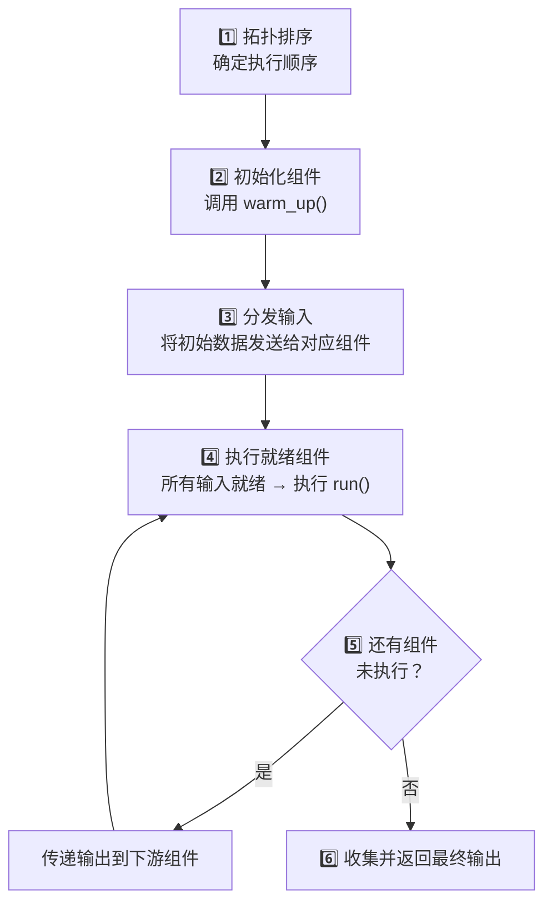

### 拓扑排序（Topological Sort）

Pipeline 使用**拓扑排序**来确定组件的执行顺序：

```python
# 假设管道结构如下：
#   A → B → D
#   A → C → D

# 拓扑排序结果可能是：
# A → B → C → D  或  A → C → B → D
# （B 和 C 的顺序不重要，因为它们互不依赖）
```

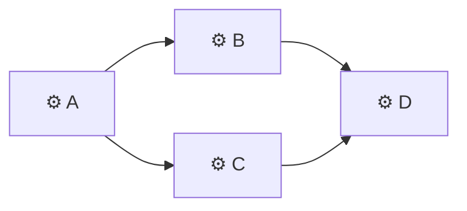

### 组件执行优先级

Haystack 使用优先级队列来管理执行顺序：

| 优先级 | 状态 | 说明 |
|--------|------|------|
| 🟢 HIGHEST | 最高优先 | 立即执行 |
| 🔵 READY | 就绪 | 所有必需输入已到达 |
| 🟡 DEFER | 延迟 | 等待可选输入 |
| 🟠 DEFER_LAST | 最后延迟 | 最后再考虑执行 |
| 🔴 BLOCKED | 阻塞 | 缺少必需输入 |

### 数据传递机制

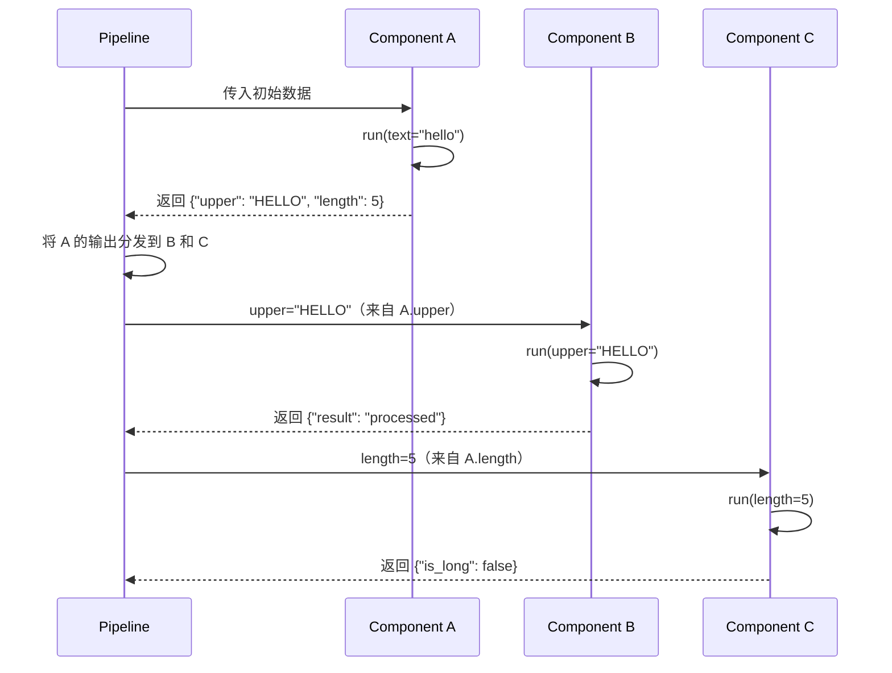

---

## 5.4 分支与路由

Pipeline 最强大的功能之一是支持**分支和条件路由**。

### 5.4.1 简单分支 —— 一个输出连多个组件

```python
@component
class TextAnalyzer:
    @component.output_types(text=str)
    def run(self, text: str) -> dict:
        return {"text": text}

@component
class WordCounter:
    @component.output_types(count=int)
    def run(self, text: str) -> dict:
        return {"count": len(text.split())}

@component
class CharCounter:
    @component.output_types(count=int)
    def run(self, text: str) -> dict:
        return {"count": len(text)}

# 分支：一个输出同时连到两个组件
pipeline = Pipeline()
pipeline.add_component("analyzer", TextAnalyzer())
pipeline.add_component("word_counter", WordCounter())
pipeline.add_component("char_counter", CharCounter())

pipeline.connect("analyzer.text", "word_counter.text")
pipeline.connect("analyzer.text", "char_counter.text")
```

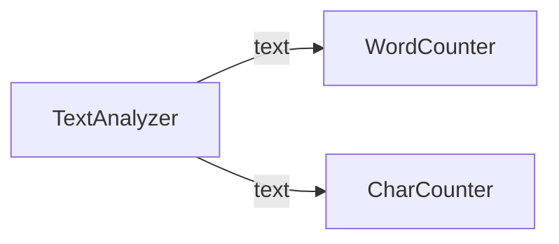

### 5.4.2 条件路由（ConditionalRouter）

```python
from haystack.components.routers import ConditionalRouter

routes = [
    {
        "condition": "{{ text|length > 100 }}",  # Jinja2 条件
        "output": "{{ text }}",
        "output_name": "long_text",
        "output_type": str,
    },
    {
        "condition": "{{ text|length <= 100 }}",
        "output": "{{ text }}",
        "output_name": "short_text",
        "output_type": str,
    },
]

pipeline = Pipeline()
pipeline.add_component("router", ConditionalRouter(routes=routes))
pipeline.add_component("long_handler", LongTextProcessor())
pipeline.add_component("short_handler", ShortTextProcessor())

pipeline.connect("router.long_text", "long_handler.text")
pipeline.connect("router.short_text", "short_handler.text")
```

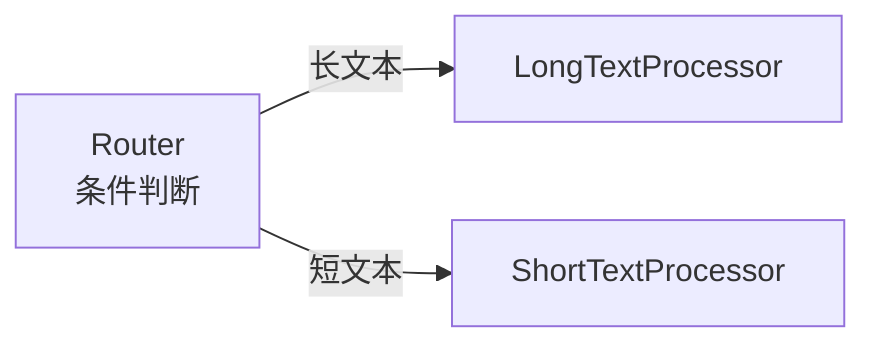

### 5.4.3 文件类型路由

```python
from haystack.components.routers import FileTypeRouter

router = FileTypeRouter(
    mime_types=["text/plain", "application/pdf", "text/markdown"]
)

pipeline = Pipeline()
pipeline.add_component("router", router)
pipeline.add_component("txt_converter", TextFileToDocument())
pipeline.add_component("pdf_converter", PyPDFToDocument())
pipeline.add_component("md_converter", MarkdownToDocument())

pipeline.connect("router.text/plain", "txt_converter.sources")
pipeline.connect("router.application/pdf", "pdf_converter.sources")
pipeline.connect("router.text/markdown", "md_converter.sources")
```

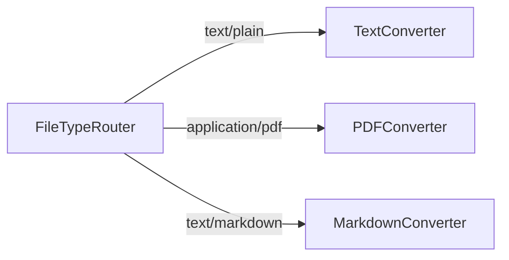

---

## 5.5 合并（Joiner）

当多个分支需要汇合时，使用 **Joiner** 组件：

```python
from haystack.components.joiners import DocumentJoiner

pipeline = Pipeline()
# ... 假设有两个检索器
pipeline.add_component("bm25_retriever", InMemoryBM25Retriever(store))
pipeline.add_component("embedding_retriever", InMemoryEmbeddingRetriever(store))
pipeline.add_component("joiner", DocumentJoiner())

# 两个检索器的输出合并到 joiner
pipeline.connect("bm25_retriever.documents", "joiner.documents")
pipeline.connect("embedding_retriever.documents", "joiner.documents")
```

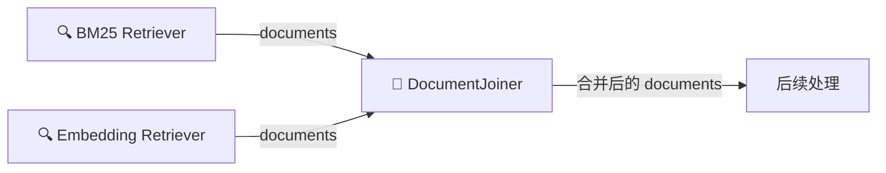

### Joiner 的合并策略

```python
# 不同的合并策略
joiner = DocumentJoiner(
    join_mode="concatenate"   # 简单拼接
    # join_mode="merge"       # 按 ID 去重
    # join_mode="reciprocal_rank_fusion"  # RRF 排序融合
)
```

| 策略 | 说明 | 适用场景 |
|------|------|----------|
| `concatenate` | 简单拼接所有列表 | 不关心重复 |
| `merge` | 按 ID 去重，保留最高分 | 多路召回去重 |
| `reciprocal_rank_fusion` | 融合排名 | 混合检索结果排序 |

---

## 5.6 管道可视化

Haystack 可以自动将管道生成为 **Mermaid 图**：

```python
# 生成 Mermaid 文本
mermaid_text = pipeline.draw_to_mermaid()
print(mermaid_text)

# 保存为图片（需要网络连接）
pipeline.draw("pipeline.png")
```

### 生成的 Mermaid 图示例

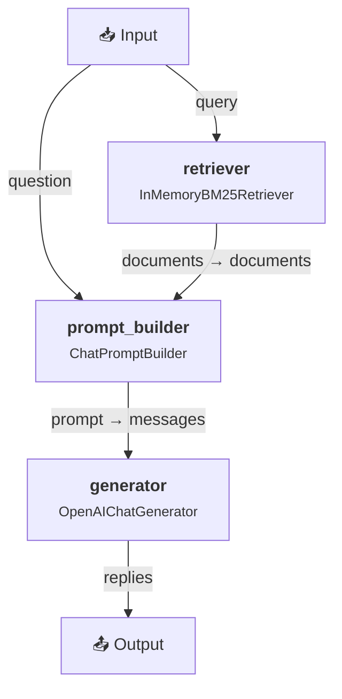

### 可视化的工作原理

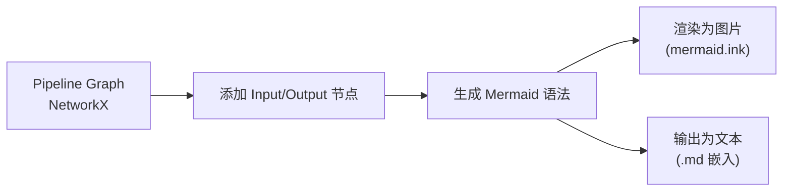

---

## 5.7 管道序列化

管道可以被保存为 YAML 或 JSON，便于版本管理和部署：

### 保存管道

```python
from pathlib import Path

# 保存为 YAML
pipeline.dump(Path("my_pipeline.yaml"))

# 保存为 JSON
pipeline.dump(Path("my_pipeline.json"))

# 获取字典表示
pipeline_dict = pipeline.to_dict()
```

### 加载管道

```python
# 从 YAML 加载
loaded = Pipeline.load(Path("my_pipeline.yaml"))

# 从字典加载
loaded = Pipeline.from_dict(pipeline_dict)
```

### YAML 格式示例

```yaml
components:
  retriever:
    type: haystack.components.retrievers.in_memory.bm25_retriever.InMemoryBM25Retriever
    init_parameters:
      document_store:
        type: haystack.document_stores.in_memory.document_store.InMemoryDocumentStore
        init_parameters: {}
      top_k: 10
  generator:
    type: haystack.components.generators.chat.openai.OpenAIChatGenerator
    init_parameters:
      model: gpt-4

connections:
  - sender: retriever.documents
    receiver: generator.documents
    
metadata:
  max_runs_per_component: 100
```

### 序列化的好处

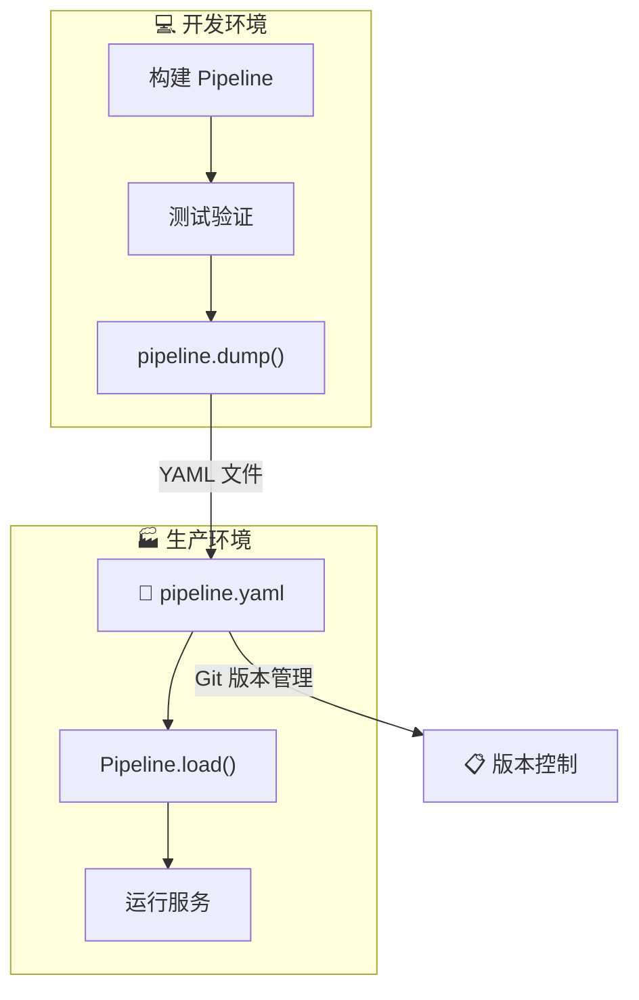

---

## 5.8 异步管道（AsyncPipeline）

对于高并发场景，Haystack 提供了异步管道：

```python
from haystack import AsyncPipeline

# 创建异步管道
async_pipeline = AsyncPipeline()
async_pipeline.add_component("retriever", AsyncRetriever())
async_pipeline.add_component("generator", AsyncGenerator())
async_pipeline.connect("retriever.documents", "generator.documents")

# 异步运行
import asyncio

async def main():
    result = await async_pipeline.run_async({
        "retriever": {"query": "什么是 Haystack？"}
    })
    print(result)

asyncio.run(main())
```

### 同步 vs 异步

| 特性 | Pipeline | AsyncPipeline |
|------|----------|---------------|
| 执行方式 | `pipeline.run()` | `await pipeline.run_async()` |
| 适用场景 | 脚本、批处理 | Web 服务、高并发 |
| 组件要求 | 实现 `run()` | 组件可实现 `run_async()`，否则回退到 `run()` |
| 性能 | 适用于 I/O 较少的场景 | 适用于大量 I/O（API 调用等） |

---

## 5.9 管道的调试技巧

### 断点（Breakpoint）

Haystack 支持在管道中设置断点：

```python
from haystack.dataclasses import BreakpointConfig

# 在特定组件前设置断点
result = pipeline.run(
    data={"retriever": {"query": "test"}},
    breakpoints=[
        BreakpointConfig(
            component_name="generator",
            visit_count=0  # 第一次执行前暂停
        )
    ]
)

# result 包含断点快照，可以检查中间状态
```

### 日志和追踪

```python
import logging

# 开启详细日志
logging.basicConfig(level=logging.DEBUG)
logger = logging.getLogger("haystack")
logger.setLevel(logging.DEBUG)

# 运行管道，可以看到每一步的执行过程
result = pipeline.run({"retriever": {"query": "test"}})
```

---

## 5.10 实战：构建一个多路检索管道

```python
from haystack import Pipeline, Document
from haystack.document_stores.in_memory import InMemoryDocumentStore
from haystack.components.retrievers.in_memory import (
    InMemoryBM25Retriever, 
    InMemoryEmbeddingRetriever
)
from haystack.components.joiners import DocumentJoiner
from haystack.components.rankers import TransformersSimilarityRanker

# 准备文档存储
store = InMemoryDocumentStore()
store.write_documents([
    Document(content="Python 是一种解释型编程语言"),
    Document(content="Java 使用 JVM 运行"),
    Document(content="Haystack 用于构建 AI 应用"),
    Document(content="向量搜索是语义检索的核心技术"),
])

# 构建多路检索管道
pipeline = Pipeline()

# 添加两种检索方式
pipeline.add_component("bm25", InMemoryBM25Retriever(document_store=store))
pipeline.add_component("embedding", InMemoryEmbeddingRetriever(document_store=store))

# 合并结果
pipeline.add_component("joiner", DocumentJoiner(join_mode="reciprocal_rank_fusion"))

# 连接
pipeline.connect("bm25.documents", "joiner.documents")
pipeline.connect("embedding.documents", "joiner.documents")

# 可视化
print(pipeline.draw_to_mermaid())
```

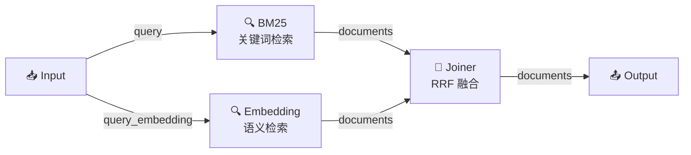

---

## 5.11 本章小结

| 知识点 | 要点 |
|--------|------|
| Pipeline 是什么 | 组件的编排引擎，基于有向图管理数据流 |
| 创建流程 | `add_component()` → `connect()` → `run()` |
| 执行原理 | 拓扑排序 + 优先级队列 + 自动数据传递 |
| 分支路由 | 一个输出可连多个组件，支持条件路由 |
| 合并 | DocumentJoiner 等组件合并多路输出 |
| 可视化 | `draw_to_mermaid()` 生成架构图 |
| 序列化 | `dump()` / `load()` 支持 YAML/JSON |
| 异步 | AsyncPipeline 支持 async/await |

### ⚠️ 常见陷阱

1. **连接类型不匹配** → 输出类型必须与输入类型兼容
2. **循环引用** → Pipeline 支持循环，但要注意退出条件
3. **缺少必需输入** → 运行前确保所有必需输入都有数据源
4. **组件名重复** → 每个组件在管道中的名称必须唯一

---

## ⏭️ 下一章预告

有了管道的基础，下一章我们将学习 Haystack 中的**数据处理组件** —— 转换器和预处理器，了解如何把各种格式的数据转换成可处理的 Document。

[👉 第6章：数据处理组件 →](./06-converters-preprocessors.md)
