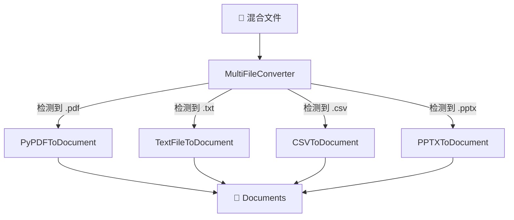
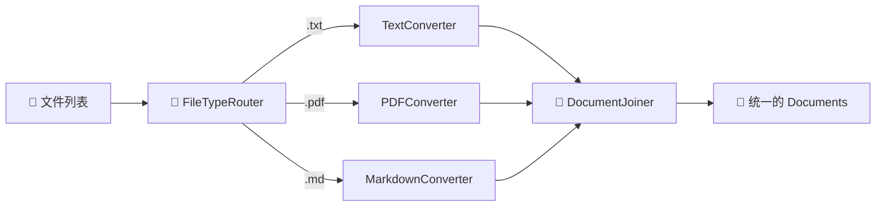
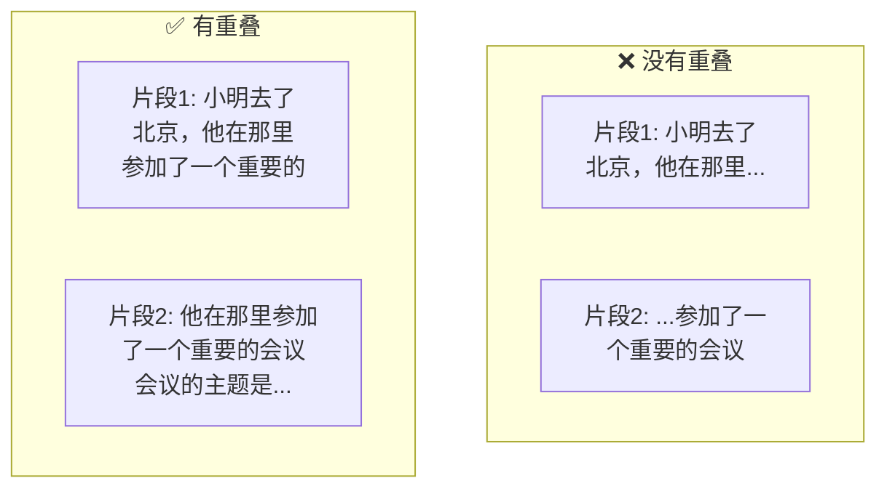
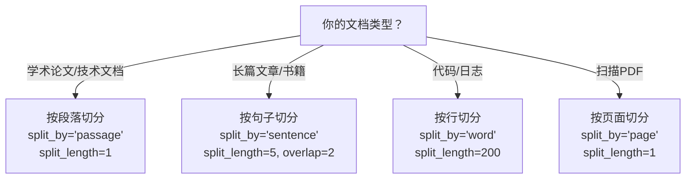

# 🔄 第6章：数据处理组件

> 学习 Haystack 中的文件转换器和文档预处理器，掌握数据进入系统的第一步

## 📌 本章目标

- 理解数据处理在 AI 应用中的重要性
- 掌握各种文件转换器的使用
- 学会文档切分和清洗的最佳实践
- 构建完整的数据索引管道

---

## 6.1 为什么数据处理如此重要？

在构建 RAG 应用时，有一句经典的说法：**"Garbage In, Garbage Out"（垃圾进，垃圾出）**。

### 🍳 做菜的类比

```
构建 AI 应用就像做一道菜：

  🥬 原材料 = 原始文件（PDF、Word、网页...）
  🔪 洗菜切菜 = 数据处理（转换、清洗、切分）
  🍳 烹饪 = AI 处理（嵌入、检索、生成）
  🍽️ 成品 = 最终回答

如果你用没洗过、切得太大的菜来做饭，
无论厨艺多高，这道菜都不会好吃。
```

### 数据处理流程


---

## 6.2 文件转换器（Converters）

转换器的作用是将各种格式的文件转换为统一的 `Document` 对象。

### 6.2.1 转换器全家福

| 转换器 | 支持格式 | 说明 |
|--------|----------|------|
| `TextFileToDocument` | `.txt` | 纯文本文件 |
| `PyPDFToDocument` | `.pdf` | PDF 文件 |
| `HTMLToDocument` | `.html` | HTML 网页 |
| `MarkdownToDocument` | `.md` | Markdown 文件 |
| `DOCXToDocument` | `.docx` | Word 文档 |
| `PPTXToDocument` | `.pptx` | PowerPoint |
| `XLSXToDocument` | `.xlsx` | Excel 表格 |
| `CSVToDocument` | `.csv` | CSV 文件 |
| `JSONConverter` | `.json` | JSON 文件 |
| `MultiFileConverter` | 多种格式 | 自动检测并选择合适的转换器 |

### 6.2.2 基本使用

```python
from haystack.components.converters import TextFileToDocument

# 创建转换器
converter = TextFileToDocument()

# 转换文件
result = converter.run(sources=["article.txt", "notes.txt"])
documents = result["documents"]

for doc in documents:
    print(f"来源: {doc.meta['file_path']}")
    print(f"内容预览: {doc.content[:100]}...")
```

### 6.2.3 PDF 转换

```python
from haystack.components.converters import PyPDFToDocument

converter = PyPDFToDocument()
result = converter.run(sources=["research_paper.pdf"])

for doc in result["documents"]:
    print(f"PDF 来源: {doc.meta['file_path']}")
    print(f"页码: {doc.meta.get('page_number', 'N/A')}")
    print(f"内容长度: {len(doc.content)} 字符")
```

### 6.2.4 万能转换器（MultiFileConverter）

不确定文件类型？用 `MultiFileConverter` 自动处理：

```python
from haystack.components.converters import MultiFileConverter

converter = MultiFileConverter()
result = converter.run(sources=[
    "report.pdf",
    "notes.txt", 
    "data.csv",
    "slides.pptx"
])

# MultiFileConverter 会自动选择合适的转换器
for doc in result["documents"]:
    print(f"文件: {doc.meta['file_path']} → 内容: {doc.content[:50]}...")
```



### 6.2.5 使用 FileTypeRouter 的手动路由方案

如果你需要对不同文件类型做不同处理：

```python
from haystack import Pipeline
from haystack.components.routers import FileTypeRouter
from haystack.components.converters import (
    TextFileToDocument,
    PyPDFToDocument,
    MarkdownToDocument,
)
from haystack.components.joiners import DocumentJoiner

# 构建文件处理管道
pipeline = Pipeline()

# 路由器：按文件类型分流
pipeline.add_component("router", FileTypeRouter(
    mime_types=["text/plain", "application/pdf", "text/markdown"]
))

# 各种转换器
pipeline.add_component("txt_converter", TextFileToDocument())
pipeline.add_component("pdf_converter", PyPDFToDocument())
pipeline.add_component("md_converter", MarkdownToDocument())

# 合并所有转换结果
pipeline.add_component("joiner", DocumentJoiner())

# 连接
pipeline.connect("router.text/plain", "txt_converter.sources")
pipeline.connect("router.application/pdf", "pdf_converter.sources")
pipeline.connect("router.text/markdown", "md_converter.sources")
pipeline.connect("txt_converter.documents", "joiner.documents")
pipeline.connect("pdf_converter.documents", "joiner.documents")
pipeline.connect("md_converter.documents", "joiner.documents")
```



---

## 6.3 文档清洗器（Cleaner）

转换后的文档可能包含很多噪声（页眉、页脚、特殊字符等），需要清洗。

### 6.3.1 DocumentCleaner

```python
from haystack.components.preprocessors import DocumentCleaner

cleaner = DocumentCleaner(
    remove_empty_lines=True,           # 删除空行
    remove_extra_whitespaces=True,     # 删除多余空格
    remove_regex=r"\[.*?\]",           # 用正则删除特定内容（如引用标记）
)

dirty_doc = Document(content="""
    这是  一段    有很多     空格的文本。
    
    
    [引用1] 这里还有引用标记。
    
    以及很多    空行。
""")

result = cleaner.run(documents=[dirty_doc])
print(result["documents"][0].content)
# "这是 一段 有很多 空格的文本。\n这里还有引用标记。\n以及很多 空行。"
```

### 清洗前后对比

| 问题 | 清洗前 | 清洗后 |
|------|--------|--------|
| 多余空格 | `"这是  一段    文本"` | `"这是 一段 文本"` |
| 空行 | 多个连续空行 | 最多一个空行 |
| 引用标记 | `"[1] 引用内容"` | `"引用内容"` |
| 页眉页脚 | 包含页码等 | 已删除 |

---

## 6.4 文档切分器（Splitter）⭐

文档切分是数据处理中**最关键的一步**。切分方式直接影响检索质量。

### 🍞 切面包的类比

```
想象你有一条长法棍面包（一篇长文档）：

  🍞 切太大 → 一块面包太大，找不到想要的部分
  🍞 切太小 → 碎屑太多，每块都没有完整信息
  🍞 合适大小 → 每块刚好一口，信息完整又便于选择

文档切分的目标：每个片段包含完整的语义信息，
同时大小适合作为 LLM 的上下文输入。
```

### 6.4.1 DocumentSplitter 基本用法

```python
from haystack.components.preprocessors import DocumentSplitter

# 按句子切分，每 3 句一个片段，重叠 1 句
splitter = DocumentSplitter(
    split_by="sentence",     # 切分单位
    split_length=3,          # 每个片段包含 3 个单位
    split_overlap=1,         # 相邻片段重叠 1 个单位
)

doc = Document(content="第一句话。第二句话。第三句话。第四句话。第五句话。")
result = splitter.run(documents=[doc])

for i, chunk in enumerate(result["documents"]):
    print(f"片段 {i+1}: {chunk.content}")
```

**输出：**
```
片段 1: 第一句话。第二句话。第三句话。
片段 2: 第三句话。第四句话。第五句话。
              ↑ 重叠部分
```

### 6.4.2 切分参数详解

| 参数 | 选项 | 说明 |
|------|------|------|
| `split_by` | `"word"` | 按单词切分 |
| | `"sentence"` | 按句子切分（推荐） |
| | `"page"` | 按页面切分 |
| | `"passage"` | 按段落切分 |
| `split_length` | `int` | 每个片段包含的单位数 |
| `split_overlap` | `int` | 相邻片段的重叠单位数 |

### 6.4.3 为什么需要重叠（Overlap）？



**没有重叠**：如果查询"小明参加了什么会议？"，可能两个片段都匹配不好，因为信息被切断了。

**有重叠**：关键信息在重叠区域得到保留，检索更准确。

### 6.4.4 切分策略选择指南



### 6.4.5 元数据继承

切分后的片段会自动继承原文档的元数据，并添加切分信息：

```python
original = Document(
    content="第一句。第二句。第三句。第四句。",
    meta={"source": "article.pdf", "author": "张三"}
)

splitter = DocumentSplitter(split_by="sentence", split_length=2)
result = splitter.run(documents=[original])

for chunk in result["documents"]:
    print(chunk.meta)
    # {
    #     "source": "article.pdf",          ← 继承
    #     "author": "张三",                  ← 继承
    #     "source_id": "original_doc_id",    ← 新增：原文档 ID
    #     "split_id": 0,                     ← 新增：片段序号
    #     "split_idx_start": 0,              ← 新增：起始位置
    # }
```

---

## 6.5 写入器（Writer）

处理完成的文档需要写入 DocumentStore 进行持久化：

```python
from haystack.components.writers import DocumentWriter
from haystack.document_stores.in_memory import InMemoryDocumentStore

store = InMemoryDocumentStore()
writer = DocumentWriter(
    document_store=store,
    policy="overwrite"     # 写入策略
)

result = writer.run(documents=[
    Document(content="文档1"),
    Document(content="文档2"),
])
print(f"写入了 {result['documents_written']} 个文档")
```

### 写入策略

| 策略 | 说明 | 适用场景 |
|------|------|----------|
| `"overwrite"` | 覆盖同 ID 文档 | 更新已有文档 |
| `"skip"` | 跳过已存在的文档 | 增量导入 |
| `"raise"` | ID 重复时报错 | 严格去重 |

---

## 6.6 实战：构建完整的文档索引管道

让我们把所有组件组合成一个完整的索引管道：

```python
from haystack import Pipeline, Document
from haystack.document_stores.in_memory import InMemoryDocumentStore
from haystack.components.converters import TextFileToDocument
from haystack.components.preprocessors import DocumentCleaner, DocumentSplitter
from haystack.components.writers import DocumentWriter

# 创建存储
store = InMemoryDocumentStore()

# 构建索引管道
indexing_pipeline = Pipeline()

# 添加组件
indexing_pipeline.add_component(
    "converter", TextFileToDocument()
)
indexing_pipeline.add_component(
    "cleaner", DocumentCleaner(
        remove_empty_lines=True,
        remove_extra_whitespaces=True
    )
)
indexing_pipeline.add_component(
    "splitter", DocumentSplitter(
        split_by="sentence",
        split_length=3,
        split_overlap=1
    )
)
indexing_pipeline.add_component(
    "writer", DocumentWriter(document_store=store)
)

# 连接组件
indexing_pipeline.connect("converter.documents", "cleaner.documents")
indexing_pipeline.connect("cleaner.documents", "splitter.documents")
indexing_pipeline.connect("splitter.documents", "writer.documents")

# 运行索引
# result = indexing_pipeline.run({
#     "converter": {"sources": ["doc1.txt", "doc2.txt"]}
# })

# 也可以直接用 Document 对象从 splitter 开始
result = indexing_pipeline.run({
    "converter": {"sources": []}  # 如果没有文件，可以从 cleaner 开始
})
```

### 管道结构可视化


---

## 6.7 本章小结

| 知识点 | 要点 |
|--------|------|
| 数据处理的重要性 | "Garbage In, Garbage Out"，数据质量决定 AI 效果 |
| Converter | 将各种文件格式转为统一的 Document 对象 |
| Cleaner | 去除噪声（空行、多余空格、特殊字符） |
| Splitter | 将长文档切分为适合检索的片段 |
| 切分策略 | 按句子/段落切分，设置适当的重叠 |
| Writer | 将处理后的文档持久化存储 |
| 元数据继承 | 切分后的片段自动继承原文档的元数据 |

### 💡 最佳实践

1. **切分大小**：对于大多数 RAG 应用，每个片段 3-5 句或 200-500 字效果较好
2. **重叠量**：通常设置为切分长度的 20%-30%
3. **清洗顺序**：先清洗再切分，避免噪声影响切分质量
4. **元数据**：尽量丰富元数据，便于后续过滤和溯源

---

## ⏭️ 下一章预告

文档准备好后，下一步就是让计算机「理解」这些文档。下一章我们将学习**嵌入（Embedding）和检索（Retrieval）** —— 语义搜索的核心技术。

[👉 第7章：嵌入与检索 →](./07-embedders-retrievers.md)
