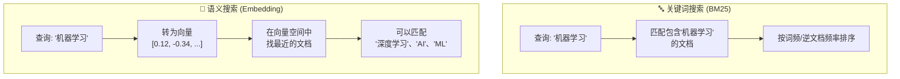
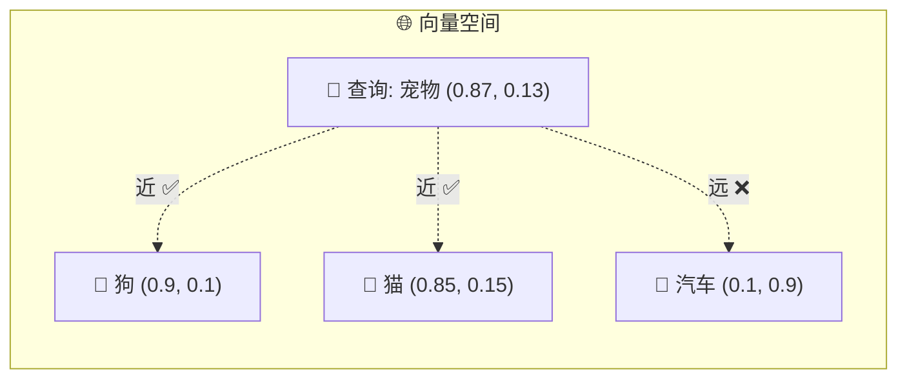
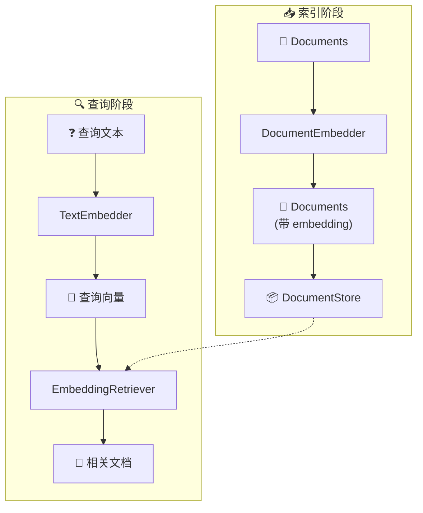
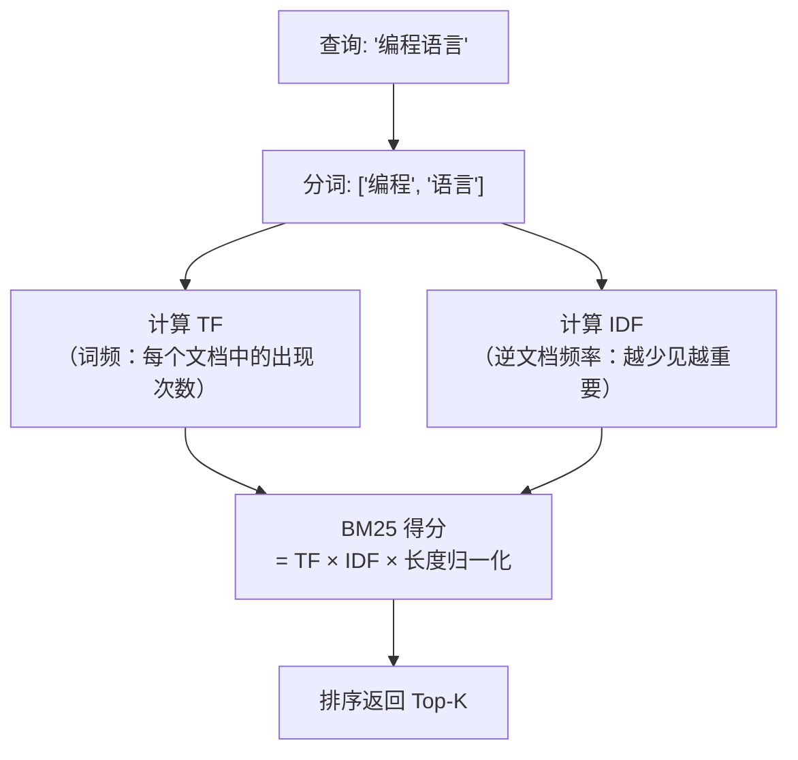
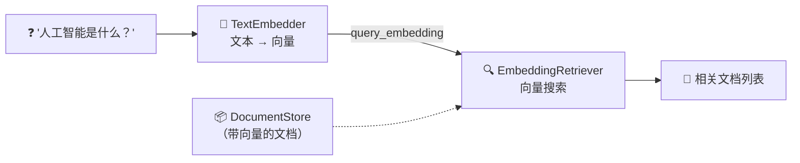
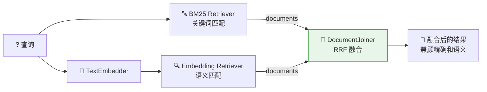
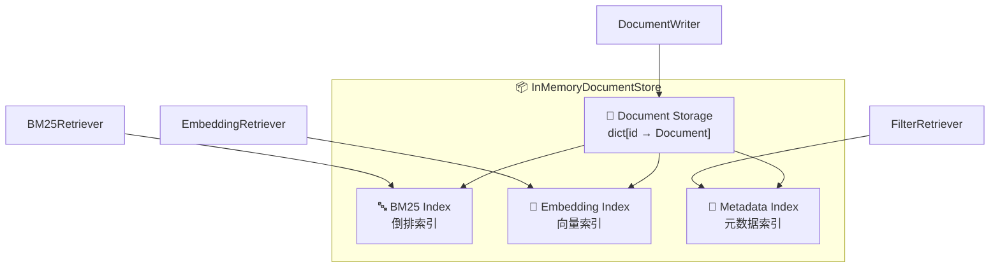

# 🔍 第7章：嵌入与检索

> 深入理解向量嵌入和检索机制，掌握语义搜索的核心技术

## 📌 本章目标

- 理解向量嵌入（Embedding）的原理
- 掌握不同检索策略（BM25 vs 向量检索）
- 学会构建高效的检索管道
- 理解混合检索的优势

---

## 7.1 从关键词搜索到语义搜索

### 🏪 超市找商品的类比

```
传统搜索（关键词匹配）：
  你问店员："有没有苹果？"
  店员只会在商品名称中搜索"苹果"这两个字
  ❌ 找不到"红富士"（虽然它就是苹果）
  ❌ 找不到"Apple"（英文名）
  
语义搜索（向量匹配）：
  你问店员："有没有苹果？"
  店员理解你要的是"一种水果"
  ✅ 找到"红富士" → 是苹果的品种！
  ✅ 找到"Apple" → 是苹果的英文！
  ✅ 甚至找到"梨" → 也是类似的水果！
```

### 两种搜索方式对比



| 特性 | 关键词搜索 (BM25) | 语义搜索 (Embedding) |
|------|-------------------|---------------------|
| 原理 | 字面匹配 | 语义理解 |
| 速度 | 🚀 极快 | 🐢 较慢（需要推理） |
| 同义词 | ❌ 不支持 | ✅ 支持 |
| 精确匹配 | ✅ 很强 | 🟡 有时会过度泛化 |
| 需要模型 | ❌ 不需要 | ✅ 需要嵌入模型 |
| 适合场景 | 精确术语搜索 | 自然语言查询 |

---

## 7.2 向量嵌入原理

### 7.2.1 什么是向量嵌入？

**向量嵌入（Embedding）** 是将文本转换为**固定长度的数值向量**的过程。这个向量在高维空间中「编码」了文本的语义信息。

### 🗺️ 地图坐标类比

```
想象一张「语义地图」：

  每个词/句子 = 地图上的一个坐标点
  意思相近的内容 = 地图上距离很近的点

  📍 "狗" → (2.1, 3.4)
  📍 "猫" → (2.3, 3.2)     ← 离"狗"很近（都是宠物）
  📍 "汽车" → (8.7, 1.2)   ← 离"狗"很远（不相关）
  📍 "小狗" → (2.0, 3.5)   ← 离"狗"非常近

当你搜索"宠物"时：
  📍 "宠物" → (2.2, 3.3)   ← 落在"狗"和"猫"附近
  系统找到最近的点 → 返回"狗"和"猫"的文档
```

### 7.2.2 向量相似度计算

两个向量之间的「距离」决定了它们的语义相似度：

```python
# 余弦相似度（Cosine Similarity）是最常用的方法
import math

def cosine_similarity(vec_a, vec_b):
    """计算两个向量的余弦相似度"""
    dot_product = sum(a * b for a, b in zip(vec_a, vec_b))
    norm_a = math.sqrt(sum(a ** 2 for a in vec_a))
    norm_b = math.sqrt(sum(b ** 2 for b in vec_b))
    return dot_product / (norm_a * norm_b)

# 示例
vec_dog = [0.9, 0.1, 0.8]   # "狗" 的向量
vec_cat = [0.85, 0.15, 0.7]  # "猫" 的向量
vec_car = [0.1, 0.9, 0.2]   # "汽车" 的向量

print(f"狗-猫 相似度: {cosine_similarity(vec_dog, vec_cat):.4f}")   # 0.99 很高
print(f"狗-汽车 相似度: {cosine_similarity(vec_dog, vec_car):.4f}") # 0.35 很低
```



---

## 7.3 Haystack 中的嵌入器

### 7.3.1 两类嵌入器

Haystack 中有两类嵌入器，它们的区别很重要：

| 类型 | 用途 | 何时使用 |
|------|------|----------|
| **DocumentEmbedder** | 为文档生成向量 | 索引阶段（写入数据时） |
| **TextEmbedder** | 为查询文本生成向量 | 查询阶段（检索时） |



### 7.3.2 SentenceTransformers（本地模型）

**优点**：免费、隐私安全、无网络依赖

```python
from haystack.components.embedders import (
    SentenceTransformersDocumentEmbedder,
    SentenceTransformersTextEmbedder,
)
from haystack.dataclasses import Document

# === 索引阶段：为文档生成嵌入 ===
doc_embedder = SentenceTransformersDocumentEmbedder(
    model="sentence-transformers/all-MiniLM-L6-v2",  # 轻量模型
    # model="sentence-transformers/all-mpnet-base-v2",  # 高质量模型
)
doc_embedder.warm_up()  # 加载模型（第一次会下载）

docs = [
    Document(content="Python 是一种编程语言"),
    Document(content="猫是一种可爱的动物"),
    Document(content="深度学习是 AI 的分支"),
]

result = doc_embedder.run(documents=docs)
for doc in result["documents"]:
    print(f"文档: {doc.content[:20]}... 向量维度: {len(doc.embedding)}")

# === 查询阶段：为查询生成嵌入 ===
text_embedder = SentenceTransformersTextEmbedder(
    model="sentence-transformers/all-MiniLM-L6-v2"
)
text_embedder.warm_up()

result = text_embedder.run(text="编程语言有哪些？")
query_embedding = result["embedding"]
print(f"查询向量维度: {len(query_embedding)}")
```

### 7.3.3 OpenAI 嵌入器（API 模型）

**优点**：高质量、多语言支持好

```python
from haystack.components.embedders import (
    OpenAIDocumentEmbedder,
    OpenAITextEmbedder,
)

# 文档嵌入
doc_embedder = OpenAIDocumentEmbedder(
    model="text-embedding-3-small",  # 高性价比
    # model="text-embedding-3-large",  # 高质量
)

# 文本嵌入
text_embedder = OpenAITextEmbedder(
    model="text-embedding-3-small"
)
```

### 7.3.4 模型选择指南

| 模型 | 维度 | 质量 | 速度 | 成本 |
|------|------|------|------|------|
| `all-MiniLM-L6-v2` | 384 | ⭐⭐⭐ | 🚀🚀🚀 | 免费 |
| `all-mpnet-base-v2` | 768 | ⭐⭐⭐⭐ | 🚀🚀 | 免费 |
| `text-embedding-3-small` | 1536 | ⭐⭐⭐⭐ | 🚀🚀 | 💰 |
| `text-embedding-3-large` | 3072 | ⭐⭐⭐⭐⭐ | 🚀 | 💰💰 |

> ⚠️ **重要**：索引和查询**必须使用同一个模型**！不同模型的向量空间不兼容。

---

## 7.4 检索器（Retriever）

### 7.4.1 BM25 检索器

**BM25（Best Match 25）** 是经典的关键词检索算法。

```python
from haystack.components.retrievers.in_memory import InMemoryBM25Retriever
from haystack.document_stores.in_memory import InMemoryDocumentStore
from haystack.dataclasses import Document

# 准备数据
store = InMemoryDocumentStore()
store.write_documents([
    Document(content="Python 是由 Guido 创建的编程语言"),
    Document(content="Java 是一种面向对象的编程语言"),
    Document(content="机器学习是人工智能的一个重要分支"),
    Document(content="深度学习使用神经网络来学习数据模式"),
])

# 创建 BM25 检索器
retriever = InMemoryBM25Retriever(
    document_store=store,
    top_k=3  # 返回最相关的 3 个文档
)

# 检索
result = retriever.run(query="什么是编程语言？")
for doc in result["documents"]:
    print(f"得分: {doc.score:.4f} | {doc.content}")
```

### BM25 的工作原理



### 7.4.2 向量检索器

```python
from haystack.components.retrievers.in_memory import InMemoryEmbeddingRetriever

# 创建向量检索器
retriever = InMemoryEmbeddingRetriever(
    document_store=store,
    top_k=3
)

# 检索（需要传入查询向量）
result = retriever.run(query_embedding=[0.12, -0.34, ...])
```

### 7.4.3 完整的语义检索管道

```python
from haystack import Pipeline
from haystack.components.embedders import SentenceTransformersTextEmbedder
from haystack.components.retrievers.in_memory import InMemoryEmbeddingRetriever
from haystack.document_stores.in_memory import InMemoryDocumentStore

# 假设 store 已经有了带向量的文档
store = InMemoryDocumentStore()

# 构建查询管道
query_pipeline = Pipeline()
query_pipeline.add_component(
    "text_embedder", 
    SentenceTransformersTextEmbedder(model="sentence-transformers/all-MiniLM-L6-v2")
)
query_pipeline.add_component(
    "retriever", 
    InMemoryEmbeddingRetriever(document_store=store, top_k=5)
)

# 连接：嵌入器的输出 → 检索器的输入
query_pipeline.connect("text_embedder.embedding", "retriever.query_embedding")

# 运行
result = query_pipeline.run({
    "text_embedder": {"text": "人工智能是什么？"}
})

for doc in result["retriever"]["documents"]:
    print(f"得分: {doc.score:.4f} | {doc.content[:50]}...")
```



---

## 7.5 混合检索

实际应用中，最好的策略往往是**混合检索** —— 同时使用关键词和语义搜索，然后融合结果。

### 为什么需要混合检索？

| 场景 | BM25 表现 | 语义检索表现 |
|------|-----------|-------------|
| "Python 3.12 新特性" | ✅ 精确匹配版本号 | 🟡 可能忽略版本号 |
| "如何学编程" | 🟡 需要精确词匹配 | ✅ 理解意图 |
| "UUID" | ✅ 精确匹配缩写 | 🟡 可能不认识缩写 |
| "提高代码质量的方法" | 🟡 可能遗漏同义词 | ✅ 理解"代码质量" |

### 混合检索管道

```python
from haystack import Pipeline
from haystack.components.retrievers.in_memory import (
    InMemoryBM25Retriever,
    InMemoryEmbeddingRetriever,
)
from haystack.components.joiners import DocumentJoiner
from haystack.components.embedders import SentenceTransformersTextEmbedder

# 构建混合检索管道
hybrid_pipeline = Pipeline()

# 关键词检索路径
hybrid_pipeline.add_component(
    "bm25_retriever", 
    InMemoryBM25Retriever(document_store=store, top_k=10)
)

# 语义检索路径
hybrid_pipeline.add_component(
    "text_embedder", 
    SentenceTransformersTextEmbedder(model="sentence-transformers/all-MiniLM-L6-v2")
)
hybrid_pipeline.add_component(
    "embedding_retriever", 
    InMemoryEmbeddingRetriever(document_store=store, top_k=10)
)

# 融合结果
hybrid_pipeline.add_component(
    "joiner", 
    DocumentJoiner(join_mode="reciprocal_rank_fusion")
)

# 连接
hybrid_pipeline.connect("text_embedder.embedding", "embedding_retriever.query_embedding")
hybrid_pipeline.connect("bm25_retriever.documents", "joiner.documents")
hybrid_pipeline.connect("embedding_retriever.documents", "joiner.documents")

# 运行
result = hybrid_pipeline.run({
    "bm25_retriever": {"query": "Python 异步编程"},
    "text_embedder": {"text": "Python 异步编程"},
})
```



### RRF（Reciprocal Rank Fusion）排序原理

```
RRF 融合算法：

  对于每个文档 d：
    RRF_score(d) = Σ  1 / (k + rank_i(d))
                    i
  
  其中：
    k = 60（常数，防止排名靠前的权重过大）
    rank_i(d) = 文档 d 在第 i 个检索器中的排名

  例如：
    文档 A 在 BM25 中排名 1，在向量中排名 5
    RRF(A) = 1/(60+1) + 1/(60+5) = 0.0164 + 0.0154 = 0.0318

    文档 B 在 BM25 中排名 3，在向量中排名 2
    RRF(B) = 1/(60+3) + 1/(60+2) = 0.0159 + 0.0161 = 0.0320

    → 文档 B 排名更高（在两个检索器中都表现不错）
```

---

## 7.6 过滤检索

除了文本匹配，还可以使用**元数据过滤**来缩小搜索范围：

```python
result = retriever.run(
    query="Python 教程",
    filters={
        "operator": "AND",
        "conditions": [
            {
                "field": "meta.category",
                "operator": "==",
                "value": "教程"
            },
            {
                "field": "meta.language",
                "operator": "==",
                "value": "zh"
            },
            {
                "field": "meta.difficulty",
                "operator": "in",
                "value": ["入门", "中级"]
            }
        ]
    }
)
```

### 过滤操作符

| 操作符 | 说明 | 示例 |
|--------|------|------|
| `==` | 等于 | `category == "教程"` |
| `!=` | 不等于 | `status != "draft"` |
| `>` / `>=` | 大于/大于等于 | `score > 0.5` |
| `<` / `<=` | 小于/小于等于 | `page <= 10` |
| `in` | 包含在列表中 | `tag in ["AI", "ML"]` |
| `not in` | 不在列表中 | `status not in ["deleted"]` |

---

## 7.7 DocumentStore 深度解析

### InMemoryDocumentStore 的内部结构



### 常用操作

```python
from haystack.document_stores.in_memory import InMemoryDocumentStore
from haystack.dataclasses import Document

store = InMemoryDocumentStore()

# 写入文档
store.write_documents([
    Document(content="文档1", meta={"tag": "A"}),
    Document(content="文档2", meta={"tag": "B"}),
])

# 查询文档数量
print(f"文档总数: {store.count_documents()}")

# 按过滤条件查询
filtered = store.filter_documents(
    filters={"field": "meta.tag", "operator": "==", "value": "A"}
)

# 删除文档
store.delete_documents(document_ids=["doc_id_1"])
```

---

## 7.8 本章小结

| 知识点 | 要点 |
|--------|------|
| 向量嵌入 | 将文本转为数值向量，编码语义信息 |
| BM25 | 基于词频的关键词检索，快速精确 |
| 语义检索 | 基于向量相似度，理解自然语言 |
| 混合检索 | 同时使用 BM25 + 向量，融合优势 |
| DocumentEmbedder | 索引阶段为文档生成向量 |
| TextEmbedder | 查询阶段为问题生成向量 |
| RRF 融合 | 融合多路检索结果的排序算法 |

### ⚠️ 关键注意事项

1. **模型一致性**：索引和查询必须使用同一个嵌入模型
2. **向量维度**：不同模型产生不同维度的向量，不可混用
3. **性能权衡**：向量维度越高，质量越好，但速度越慢
4. **混合策略**：生产环境推荐混合检索

---

## ⏭️ 下一章预告

检索到相关文档后，下一步就是让 LLM 生成回答。下一章我们将学习 **Generators 和对话系统** —— 让 AI 真正「开口说话」。

[👉 第8章：LLM 生成与对话 →](./08-generators-chat.md)
