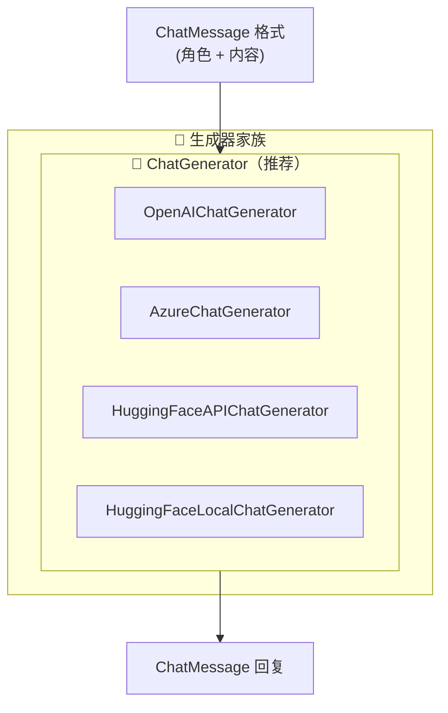
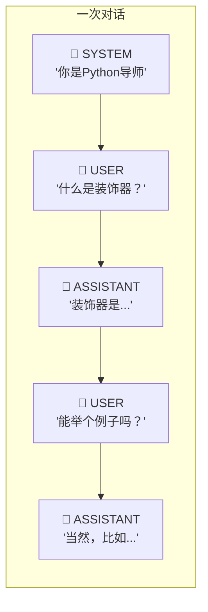
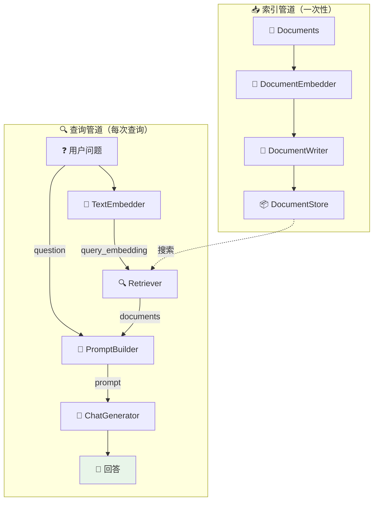
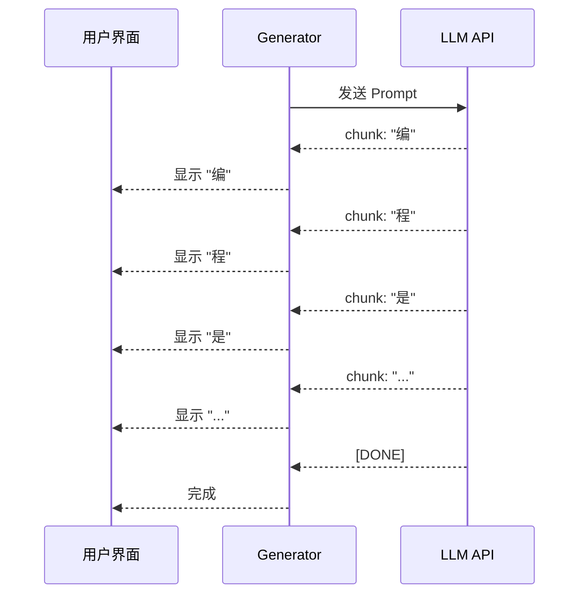
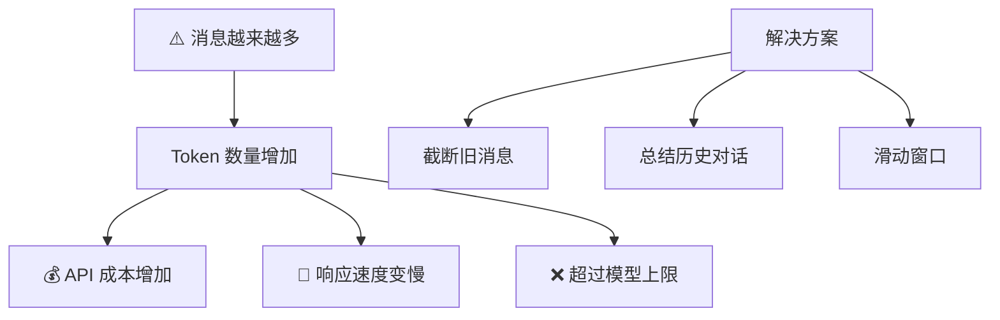

# 💬 第8章：LLM 生成与对话

> 学习如何使用 Haystack 的生成器组件与大语言模型交互

## 📌 本章目标

- 理解 Generator 和 ChatGenerator 的区别
- 掌握 Prompt 构建技巧
- 学会构建完整的 RAG 问答管道
- 了解流式输出和对话管理

---

## 8.1 生成器概述

**Generator（生成器）** 是 Haystack 中与大语言模型（LLM）交互的组件。简单来说，就是「向 AI 提问并获得回答」的组件。

### 🎤 翻译员类比

```
生成器就像一个专业翻译员：

  你（Pipeline）→ 给翻译员一份材料和问题（Prompt）
  翻译员（Generator）→ 阅读材料，用 AI 生成回答（LLM）
  翻译员 → 把回答交给你（Response）

不同的翻译员（Generator）对接不同的 AI 公司：
  🟢 OpenAIChatGenerator → 对接 OpenAI (GPT-4)
  🔵 AzureChatGenerator → 对接 Azure OpenAI
  🟣 HuggingFaceAPIChatGenerator → 对接 HuggingFace
  🟤 HuggingFaceLocalChatGenerator → 使用本地模型
```

### 生成器的分类



> 💡 **建议**：优先使用 **ChatGenerator**（对话格式），这是现代 LLM 的标准交互方式。

---

## 8.2 ChatMessage —— 对话的基本单位

在使用 ChatGenerator 之前，先了解 **ChatMessage**：

```python
from haystack.dataclasses import ChatMessage

# 系统消息：设定 AI 的角色和行为
system = ChatMessage.from_system(
    "你是一个专业的 Python 编程导师，用简单的中文回答问题。"
)

# 用户消息：用户的提问
user = ChatMessage.from_user("什么是列表推导式？")

# 助手消息：AI 的回复（通常由 Generator 生成）
assistant = ChatMessage.from_assistant(
    "列表推导式是 Python 中创建列表的简洁方式..."
)
```

### 对话的角色



| 角色 | 说明 | 使用场景 |
|------|------|----------|
| `SYSTEM` | 系统指令 | 设定 AI 的身份、行为准则、输出格式 |
| `USER` | 用户输入 | 用户的问题或请求 |
| `ASSISTANT` | AI 回复 | 之前的 AI 回答（多轮对话） |
| `TOOL` | 工具结果 | 工具调用的返回值（Agent 使用） |

---

## 8.3 使用 ChatGenerator

### 8.3.1 OpenAIChatGenerator

```python
from haystack.components.generators.chat import OpenAIChatGenerator
from haystack.dataclasses import ChatMessage

# 创建生成器
generator = OpenAIChatGenerator(
    model="gpt-4",                    # 模型名称
    generation_kwargs={
        "temperature": 0.7,           # 创造性（0=确定性，1=随机）
        "max_tokens": 500,            # 最大输出长度
    }
)

# 构建消息
messages = [
    ChatMessage.from_system("你是一个友好的 AI 助手。"),
    ChatMessage.from_user("用一句话解释什么是 Haystack"),
]

# 生成回复
result = generator.run(messages=messages)

# 获取回复
reply = result["replies"][0]  # ChatMessage 对象
print(reply.text)
# "Haystack 是一个开源 AI 编排框架，用于构建生产级的检索增强生成（RAG）应用。"
```

### 8.3.2 生成参数说明

| 参数 | 类型 | 说明 |
|------|------|------|
| `temperature` | 0.0 ~ 2.0 | 越高越随机/创造性，越低越确定性 |
| `max_tokens` | int | 最大生成 token 数 |
| `top_p` | 0.0 ~ 1.0 | 核采样概率阈值 |
| `stop` | list[str] | 停止生成的标记 |
| `frequency_penalty` | -2.0 ~ 2.0 | 降低重复词的概率 |

### 🌡️ Temperature 直观理解

```
temperature = 0.0  →  每次都给出相同答案（考试模式）
temperature = 0.3  →  基本一致，偶有变化（写报告）
temperature = 0.7  →  有创造性，保持连贯（写文章）✅ 推荐
temperature = 1.0  →  非常有创造性（写诗歌）
temperature = 1.5+ →  可能不连贯（头脑风暴）
```

---

## 8.4 Prompt 构建

### 8.4.1 ChatPromptBuilder

**ChatPromptBuilder** 是 Haystack 中构建 Prompt 的核心组件。它使用 **Jinja2 模板语法**来动态组装 Prompt。

```python
from haystack.components.builders import ChatPromptBuilder
from haystack.dataclasses import ChatMessage

# 创建带模板的 Prompt Builder
prompt_builder = ChatPromptBuilder()

# 使用 Jinja2 模板
template = [ChatMessage.from_user("""
根据以下文档回答用户的问题。如果文档中没有答案，请说"我不确定"。

文档内容：

---
{{ doc.content }}
---


用户问题：{{ question }}

请用中文回答：
""")]

result = prompt_builder.run(
    template=template,
    question="什么是 Haystack？",
    documents=[doc1, doc2, doc3]
)

# result["prompt"] 包含渲染后的完整 Prompt
```

### 8.4.2 Jinja2 模板语法速查

| 语法 | 说明 | 示例 |
|------|------|------|
| `{{ variable }}` | 变量插入 | `{{ question }}` |
| `` | 循环 | 遍历文档列表 |
| `` | 条件判断 | 根据条件显示不同内容 |
| `{{ value \| filter }}` | 过滤器 | `{{ text \| upper }}` |

### 8.4.3 Prompt 工程最佳实践

```python
# ✅ 好的 Prompt 模板
good_template = [ChatMessage.from_user("""
你是一个专业的技术文档助手。请根据提供的文档回答问题。

规则：
1. 只基于提供的文档回答
2. 如果文档中没有相关信息，明确说"根据提供的文档，我无法回答此问题"
3. 在回答中引用具体的文档来源
4. 使用简洁清晰的中文

参考文档：

[来源: {{ doc.meta.source }}]
{{ doc.content }}


问题：{{ question }}
""")]

# ❌ 不好的 Prompt
bad_template = [ChatMessage.from_user("""
{{ question }}
{{ documents }}
""")]
# 问题：没有指令、没有格式要求、文档格式不清晰
```

---

## 8.5 构建完整的 RAG 管道

现在让我们把所有学到的组件组合在一起，构建一个完整的 RAG（检索增强生成）管道：

```python
from haystack import Pipeline, Document
from haystack.document_stores.in_memory import InMemoryDocumentStore
from haystack.components.embedders import (
    SentenceTransformersDocumentEmbedder,
    SentenceTransformersTextEmbedder,
)
from haystack.components.retrievers.in_memory import InMemoryEmbeddingRetriever
from haystack.components.builders import ChatPromptBuilder
from haystack.components.generators.chat import OpenAIChatGenerator
from haystack.components.writers import DocumentWriter
from haystack.dataclasses import ChatMessage

# ========================================
# 📥 第一步：索引管道（准备数据）
# ========================================
document_store = InMemoryDocumentStore()

indexing_pipeline = Pipeline()
indexing_pipeline.add_component(
    "embedder", 
    SentenceTransformersDocumentEmbedder(model="sentence-transformers/all-MiniLM-L6-v2")
)
indexing_pipeline.add_component(
    "writer", 
    DocumentWriter(document_store=document_store)
)
indexing_pipeline.connect("embedder.documents", "writer.documents")

# 准备文档
docs = [
    Document(content="Haystack 是 deepset 开发的开源 AI 编排框架。"),
    Document(content="RAG 是检索增强生成的缩写，结合了检索和生成技术。"),
    Document(content="Pipeline 是 Haystack 的核心，用于连接多个组件。"),
    Document(content="Component 是 Pipeline 中的基本处理单元。"),
]

indexing_pipeline.run({"embedder": {"documents": docs}})
print(f"✅ 已索引 {document_store.count_documents()} 个文档")

# ========================================
# 🔍 第二步：查询管道（RAG）
# ========================================
rag_pipeline = Pipeline()

# 文本嵌入
rag_pipeline.add_component(
    "text_embedder", 
    SentenceTransformersTextEmbedder(model="sentence-transformers/all-MiniLM-L6-v2")
)

# 检索
rag_pipeline.add_component(
    "retriever", 
    InMemoryEmbeddingRetriever(document_store=document_store, top_k=3)
)

# Prompt 构建
rag_pipeline.add_component("prompt_builder", ChatPromptBuilder())

# LLM 生成
rag_pipeline.add_component(
    "generator", 
    OpenAIChatGenerator(model="gpt-4")
)

# 连接组件
rag_pipeline.connect("text_embedder.embedding", "retriever.query_embedding")
rag_pipeline.connect("retriever.documents", "prompt_builder.documents")
rag_pipeline.connect("prompt_builder.prompt", "generator.messages")

# 运行查询
template = [ChatMessage.from_user("""
根据以下文档回答问题：

- {{ doc.content }}


问题：{{ question }}
请用中文简洁回答。
""")]

result = rag_pipeline.run({
    "text_embedder": {"text": "Haystack 是什么？"},
    "prompt_builder": {
        "template": template,
        "question": "Haystack 是什么？"
    }
})

answer = result["generator"]["replies"][0].text
print(f"🤖 回答: {answer}")
```

### RAG 管道架构图



---

## 8.6 流式输出（Streaming）

对于长回答，流式输出能让用户体验更好（像 ChatGPT 一样逐字显示）：

```python
from haystack.components.generators.chat import OpenAIChatGenerator
from haystack.dataclasses import ChatMessage, StreamingChunk

# 定义流式回调
def stream_callback(chunk: StreamingChunk):
    """每产生一个 token 就调用一次"""
    print(chunk.content, end="", flush=True)

# 创建支持流式输出的生成器
generator = OpenAIChatGenerator(
    model="gpt-4",
    streaming_callback=stream_callback  # 设置回调
)

messages = [
    ChatMessage.from_user("写一首关于编程的短诗")
]

# 运行时会逐字输出
result = generator.run(messages=messages)
# 输出会一个字一个字地出现
```

### 流式输出原理



---

## 8.7 多轮对话

要实现多轮对话，需要维护消息历史：

```python
from haystack.components.generators.chat import OpenAIChatGenerator
from haystack.dataclasses import ChatMessage

generator = OpenAIChatGenerator(model="gpt-4")

# 维护对话历史
conversation = [
    ChatMessage.from_system("你是一个友好的 Python 编程助手。")
]

def chat(user_input: str) -> str:
    """模拟一轮对话"""
    # 添加用户消息
    conversation.append(ChatMessage.from_user(user_input))
    
    # 生成回复（传入完整历史）
    result = generator.run(messages=conversation)
    reply = result["replies"][0]
    
    # 将 AI 回复也加入历史
    conversation.append(reply)
    
    return reply.text

# 多轮对话示例
print(chat("什么是装饰器？"))
# "装饰器是一种修改函数行为的语法糖..."

print(chat("能给我一个简单的例子吗？"))
# "当然！比如一个计时装饰器..."（记得上下文）

print(chat("能用在类上吗？"))
# "是的，装饰器也可以用在类上..."（继续基于之前的对话）
```

### 对话管理的注意事项



---

## 8.8 FallbackChatGenerator（容错）

在生产环境中，单个 LLM 提供商可能出现故障。`FallbackChatGenerator` 提供了自动回退机制：

```python
from haystack.components.generators.chat import OpenAIChatGenerator

# 如果第一个模型失败，自动切换到第二个
# 这种模式可以通过管道中的路由逻辑实现
primary = OpenAIChatGenerator(model="gpt-4")
fallback = OpenAIChatGenerator(model="gpt-3.5-turbo")
```

---

## 8.9 实战：问答机器人完整示例

```python
from haystack import Pipeline, Document
from haystack.document_stores.in_memory import InMemoryDocumentStore
from haystack.components.retrievers.in_memory import InMemoryBM25Retriever
from haystack.components.builders import ChatPromptBuilder
from haystack.components.generators.chat import OpenAIChatGenerator
from haystack.dataclasses import ChatMessage

# === 知识库 ===
knowledge = [
    Document(content="Haystack 是 deepset 开发的开源 AI 框架，用于构建 RAG 和 Agent 应用。"),
    Document(content="RAG 全称 Retrieval-Augmented Generation，即检索增强生成。"),
    Document(content="Pipeline 通过连接多个 Component 来构建数据处理流程。"),
    Document(content="Component 是 Pipeline 中的基本单元，每个组件专注做一件事。"),
    Document(content="Document 是 Haystack 中的核心数据模型，包含内容、元数据和向量。"),
]

store = InMemoryDocumentStore()
store.write_documents(knowledge)

# === 构建问答管道 ===
qa_pipeline = Pipeline()
qa_pipeline.add_component("retriever", InMemoryBM25Retriever(document_store=store, top_k=3))
qa_pipeline.add_component("prompt_builder", ChatPromptBuilder())
qa_pipeline.add_component("generator", OpenAIChatGenerator(model="gpt-4"))

qa_pipeline.connect("retriever.documents", "prompt_builder.documents")
qa_pipeline.connect("prompt_builder.prompt", "generator.messages")

# === 查询函数 ===
def ask(question: str) -> str:
    template = [ChatMessage.from_user("""
你是 Haystack 框架的技术专家。请根据以下参考资料回答用户的问题。

参考资料：

• {{ doc.content }}


用户问题：{{ question }}

请用简洁的中文回答：
    """)]
    
    result = qa_pipeline.run({
        "retriever": {"query": question},
        "prompt_builder": {
            "template": template,
            "question": question,
        }
    })
    return result["generator"]["replies"][0].text

# === 使用 ===
# print(ask("什么是 RAG？"))
# print(ask("Pipeline 和 Component 是什么关系？"))
```

---

## 8.10 本章小结

| 知识点 | 要点 |
|--------|------|
| ChatGenerator | 与 LLM 交互的组件，支持多种提供商 |
| ChatMessage | 对话的基本单位，有 SYSTEM/USER/ASSISTANT/TOOL 四种角色 |
| ChatPromptBuilder | 使用 Jinja2 模板构建 Prompt |
| RAG 管道 | 检索 + Prompt 构建 + 生成 = 完整问答 |
| 流式输出 | 逐 token 返回结果，提升用户体验 |
| 多轮对话 | 维护消息历史实现上下文感知 |
| Temperature | 控制回答的创造性和确定性 |

### 💡 Prompt 工程小贴士

1. **明确角色**：在 SYSTEM 消息中明确 AI 的角色
2. **给出规则**：列出回答的规则和限制
3. **提供示例**：给出期望的回答格式示例
4. **使用分隔符**：用明确的分隔符区分文档和问题
5. **限制回答**：要求"只基于提供的文档回答"

---

## ⏭️ 下一章预告

掌握了检索和生成之后，下一章我们将进入更高级的领域 —— **Agent（智能体）和 Tool（工具）系统**，让 AI 能够自主决策和调用外部工具。

[👉 第9章：Agent 与 Tool →](./09-agents-tools.md)
