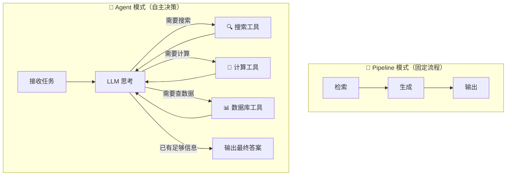
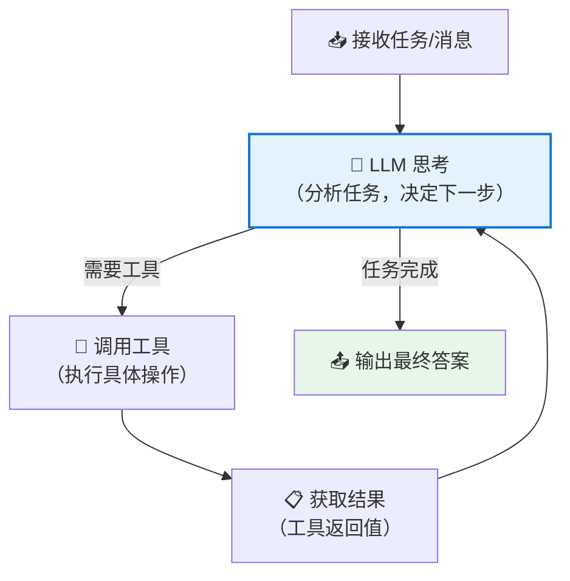
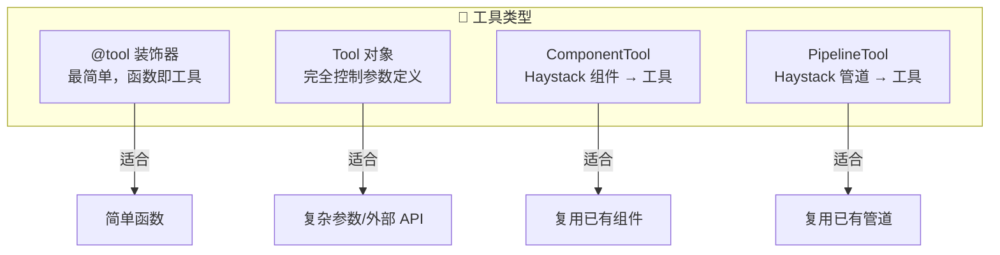
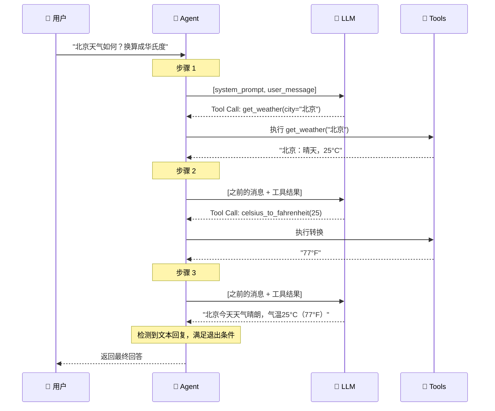
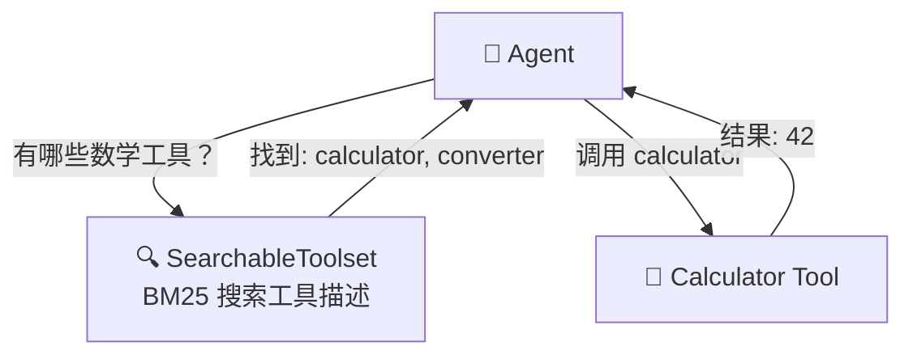
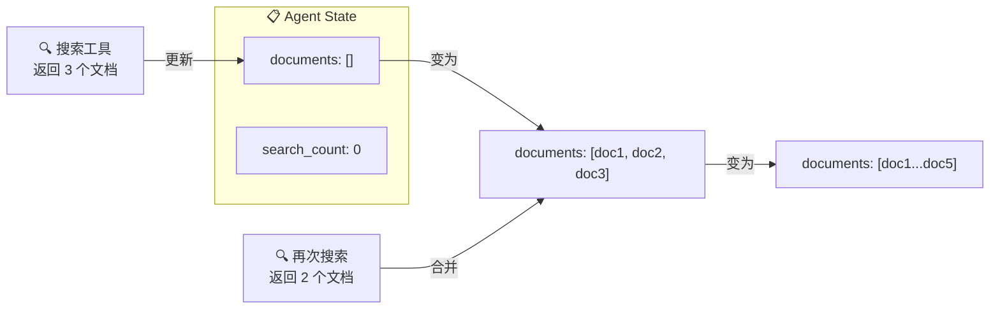
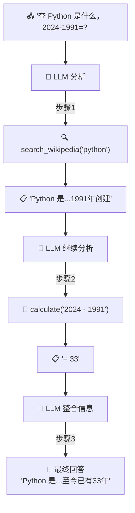

# 🤖 第9章：Agent 与 Tool

> 学习 Haystack 的智能体系统，构建能自主决策和调用工具的 AI 应用

## 📌 本章目标

- 理解 Agent 的工作原理和设计理念
- 掌握 Tool 的定义和使用方式
- 学会构建有工具能力的智能体
- 了解 Agent 的高级特性

---

## 9.1 什么是 Agent？

### 🕵️ 侦探类比

```
传统的 RAG 管道像一条固定的流水线：
  查询 → 检索 → 生成 → 完成
  （就像一个只会按步骤执行的机器人）

而 Agent（智能体）像一个侦探：
  接到任务 → 思考需要什么信息
  → 决定使用什么工具
  → 获得结果后再思考
  → 可能需要更多信息
  → 继续调用工具
  → 最终给出答案

关键区别：Agent 能自主决策，而不是按固定流程执行！
```

### Pipeline vs Agent



| 特性 | Pipeline | Agent |
|------|----------|-------|
| 执行方式 | 固定流程 | 自主决策 |
| 灵活性 | 低（预设路径） | 高（动态选择） |
| 适用场景 | 简单问答、固定流程 | 复杂任务、多步推理 |
| 资源消耗 | 可预测 | 不确定（可能多次 LLM 调用） |

---

## 9.2 Agent 的工作原理

### 9.2.1 Agent 循环

Agent 的核心是一个**思考-行动-观察**循环：



### 9.2.2 具体步骤

```
第1步：用户说 "北京今天的天气怎么样？气温多少华氏度？"

第2步：LLM 思考 → "我需要查天气，我有一个天气查询工具"
       → 决定调用 get_weather(city="北京")

第3步：工具返回 → "北京：晴天，25°C"

第4步：LLM 思考 → "用户还问了华氏度，我需要转换"
       → 决定调用 celsius_to_fahrenheit(celsius=25)

第5步：工具返回 → "77°F"

第6步：LLM 思考 → "现在我有了所有信息，可以回答了"
       → 输出："北京今天天气晴朗，气温25°C（77°F）。"
```

---

## 9.3 Tool —— 工具系统

### 9.3.1 什么是 Tool？

**Tool（工具）** 是 Agent 可以调用的函数。每个工具有：
- **名称**：工具的标识
- **描述**：告诉 LLM 这个工具能做什么
- **参数定义**：告诉 LLM 需要传什么参数
- **执行函数**：实际执行的 Python 函数

### 9.3.2 创建工具的方式

#### 方式一：使用 `@tool` 装饰器（推荐 ✅）

```python
from haystack.tools import tool
from typing import Annotated

@tool
def get_weather(
    city: Annotated[str, "要查询天气的城市名称"],
    unit: Annotated[str, "温度单位，'celsius' 或 'fahrenheit'"] = "celsius"
) -> str:
    """查询指定城市的当前天气信息。"""
    # 这里是实际的天气查询逻辑
    # 简化示例
    weather_data = {
        "北京": {"temp": 25, "condition": "晴"},
        "上海": {"temp": 28, "condition": "多云"},
    }
    
    data = weather_data.get(city, {"temp": 20, "condition": "未知"})
    temp = data["temp"]
    if unit == "fahrenheit":
        temp = temp * 9/5 + 32
    
    return f"{city}: {data['condition']}，{temp}°{'F' if unit == 'fahrenheit' else 'C'}"

# @tool 装饰器自动从函数签名中提取：
# - 名称：get_weather
# - 描述：从 docstring 中提取
# - 参数：从类型注解中提取
# - 函数：get_weather 本身
```

#### 方式二：手动创建 Tool 对象

```python
from haystack.tools import Tool

def calculate(expression: str) -> str:
    """计算数学表达式"""
    try:
        result = eval(expression)  # 注意：生产环境不要用 eval
        return str(result)
    except Exception as e:
        return f"计算错误: {e}"

calculator_tool = Tool(
    name="calculator",
    description="计算数学表达式。输入一个数学表达式字符串，返回计算结果。",
    parameters={
        "type": "object",
        "properties": {
            "expression": {
                "type": "string",
                "description": "数学表达式，如 '2 + 3 * 4'"
            }
        },
        "required": ["expression"]
    },
    function=calculate
)
```

#### 方式三：ComponentTool —— 把 Haystack 组件变成工具

```python
from haystack.tools import ComponentTool
from haystack.components.retrievers.in_memory import InMemoryBM25Retriever

# 把检索器包装为工具
retriever = InMemoryBM25Retriever(document_store=store)
search_tool = ComponentTool(
    component=retriever,
    name="knowledge_search",
    description="在知识库中搜索相关文档"
)
```

#### 方式四：PipelineTool —— 把管道变成工具

```python
from haystack.tools import PipelineTool

# 把整个 RAG 管道包装为工具
rag_tool = PipelineTool(
    pipeline=rag_pipeline,
    name="rag_search",
    description="使用 RAG 管道搜索并回答问题",
    input_mapping={"query": ["text_embedder.text", "retriever.query"]},
    output_mapping={"generator.replies": "answer"}
)
```

### 9.3.3 工具层级



---

## 9.4 构建 Agent

### 9.4.1 基本 Agent

```python
from haystack.components.agents import Agent
from haystack.components.generators.chat import OpenAIChatGenerator
from haystack.dataclasses import ChatMessage

# 定义工具
@tool
def search_knowledge(query: Annotated[str, "搜索查询"]) -> str:
    """在知识库中搜索信息。"""
    # 模拟搜索
    return f"搜索 '{query}' 的结果：Haystack 是一个 AI 编排框架。"

@tool
def get_current_time() -> str:
    """获取当前时间。"""
    from datetime import datetime
    return datetime.now().strftime("%Y-%m-%d %H:%M:%S")

# 创建 Agent
agent = Agent(
    chat_generator=OpenAIChatGenerator(model="gpt-4"),
    tools=[search_knowledge, get_current_time],
    system_prompt="你是一个有帮助的 AI 助手。当需要信息时，使用提供的工具。",
    exit_conditions=["text"],     # 当 AI 生成文本回复时退出
    max_agent_steps=10,           # 最多执行 10 步
)

# 运行 Agent
result = agent.run(
    messages=[ChatMessage.from_user("现在几点了？Haystack 是什么？")]
)

# 获取最终回答
final_message = result["messages"][-1]
print(final_message.text)
```

### 9.4.2 Agent 的关键参数

| 参数 | 说明 | 默认值 |
|------|------|--------|
| `chat_generator` | LLM 生成器 | 必需 |
| `tools` | 工具列表 | `None` |
| `system_prompt` | 系统提示词 | `None` |
| `exit_conditions` | 退出条件 | `["text"]` |
| `max_agent_steps` | 最大执行步数 | `100` |
| `state_schema` | 自定义状态结构 | `None` |

### 9.4.3 退出条件（Exit Conditions）

```python
# 方式一：当 AI 生成文本回复时退出（最常用）
agent = Agent(exit_conditions=["text"])

# 方式二：当调用特定工具后退出
agent = Agent(exit_conditions=["final_answer"])
# → Agent 调用名为 "final_answer" 的工具后就退出

# 方式三：混合条件
agent = Agent(exit_conditions=["text", "submit_result"])
# → 生成文本或调用 submit_result 工具后退出
```

---

## 9.5 Agent 的执行流程详解



---

## 9.6 Toolset —— 工具集

当你有很多相关的工具时，可以用 **Toolset** 来组织它们：

```python
from haystack.tools import Toolset

# 创建工具集
math_toolset = Toolset(tools=[
    calculator_tool,
    unit_converter_tool,
    statistics_tool,
])

# 在 Agent 中使用工具集
agent = Agent(
    chat_generator=OpenAIChatGenerator(model="gpt-4"),
    tools=[math_toolset, search_tool],  # 可以混合 Toolset 和 Tool
)
```

### SearchableToolset

当工具非常多时（数十甚至上百个），`SearchableToolset` 可以让 Agent 动态发现工具：

```python
from haystack.tools import SearchableToolset

# 创建可搜索的工具集
searchable_tools = SearchableToolset(tools=all_100_tools)

# SearchableToolset 会提供一个 "search_tools" 工具
# Agent 可以先搜索需要的工具，再调用它
# 这避免了把所有工具描述都塞进 Prompt（太长了）
```



---

## 9.7 Agent 状态管理

Agent 可以在执行过程中维护**状态**，在工具调用之间传递数据：

```python
from haystack.dataclasses import Document

agent = Agent(
    chat_generator=OpenAIChatGenerator(model="gpt-4"),
    tools=[search_tool, summarize_tool],
    state_schema={
        "documents": {
            "type": list[Document],
            "handler": lambda old, new: (old or []) + new,  # 合并列表
        },
        "search_count": {
            "type": int,
            "handler": lambda old, new: (old or 0) + new,  # 累加
        }
    }
)
```

### 状态如何工作



### 工具与状态的交互

```python
# 工具可以从状态读取数据
search_tool = Tool(
    name="search",
    ...,
    inputs_from_state={"previous_queries": "search_history"},  # 从状态读
    outputs_to_state={"results": "documents"},                  # 写入状态
)
```

---

## 9.8 实战：构建一个研究助手 Agent

```python
from haystack.components.agents import Agent
from haystack.components.generators.chat import OpenAIChatGenerator
from haystack.tools import tool
from haystack.dataclasses import ChatMessage
from typing import Annotated

# === 定义工具 ===

@tool
def search_wikipedia(query: Annotated[str, "搜索关键词"]) -> str:
    """在百科全书中搜索信息。当需要了解某个概念或事实时使用。"""
    # 模拟百科搜索
    knowledge = {
        "python": "Python 是一种解释型、交互式、面向对象的编程语言，由 Guido van Rossum 于 1991 年创建。",
        "机器学习": "机器学习是人工智能的一个分支，它通过数据和算法让计算机自动学习和改进。",
        "haystack": "Haystack 是 deepset 公司开发的开源 AI 编排框架，用于构建 RAG 和 Agent 应用。",
    }
    for key, value in knowledge.items():
        if key.lower() in query.lower():
            return value
    return f"未找到与 '{query}' 相关的信息。"

@tool
def calculate(expression: Annotated[str, "数学表达式"]) -> str:
    """计算数学表达式。当需要进行数学运算时使用。"""
    try:
        # 安全的数学计算
        allowed_chars = set("0123456789+-*/.() ")
        if all(c in allowed_chars for c in expression):
            result = eval(expression)
            return f"计算结果: {expression} = {result}"
        return "不安全的表达式"
    except Exception as e:
        return f"计算错误: {e}"

@tool
def summarize_text(
    text: Annotated[str, "要总结的文本"],
    max_sentences: Annotated[int, "总结的最大句数"] = 2
) -> str:
    """总结一段文本为简短的摘要。"""
    sentences = text.split("。")
    summary = "。".join(sentences[:max_sentences]) + "。"
    return f"摘要：{summary}"

# === 创建 Agent ===
research_agent = Agent(
    chat_generator=OpenAIChatGenerator(model="gpt-4"),
    tools=[search_wikipedia, calculate, summarize_text],
    system_prompt="""你是一个专业的研究助手。
    
你的职责是：
1. 使用搜索工具查找信息
2. 使用计算工具进行必要的计算
3. 使用总结工具整理信息
4. 最终给出完整、准确的回答

请始终使用中文回答。""",
    exit_conditions=["text"],
    max_agent_steps=15,
)

# === 运行 ===
# result = research_agent.run(
#     messages=[ChatMessage.from_user(
#         "请帮我查一下 Python 是什么，并告诉我 2024 - 1991 等于多少年？"
#     )]
# )
# print(result["messages"][-1].text)
```

### Agent 处理这个请求的过程



---

## 9.9 Agent 的高级特性

### 9.9.1 User Prompt 模板

Agent 支持使用 Jinja2 模板定义用户提示词：

```python
agent = Agent(
    chat_generator=OpenAIChatGenerator(model="gpt-4"),
    tools=[search_tool],
    user_prompt="请回答关于 {{ topic }} 的问题：{{ question }}",
)

result = agent.run(
    messages=[],
    topic="Haystack",
    question="它的核心概念是什么？"
)
```

### 9.9.2 异步 Agent

```python
import asyncio

# Agent 支持异步运行
result = await agent.run_async(
    messages=[ChatMessage.from_user("你好")]
)
```

### 9.9.3 Agent 作为 Pipeline 组件

Agent 本身就是一个 Component，可以嵌入 Pipeline：

```python
from haystack import Pipeline

pipeline = Pipeline()
pipeline.add_component("preprocessor", TextPreprocessor())
pipeline.add_component("agent", research_agent)
pipeline.connect("preprocessor.text", "agent.messages")
```

---

## 9.10 本章小结

| 知识点 | 要点 |
|--------|------|
| Agent 是什么 | 能自主决策、调用工具的智能体 |
| Agent 循环 | 思考 → 行动 → 观察 → 思考... 直到完成 |
| Tool 定义 | `@tool` 装饰器、`Tool` 对象、`ComponentTool`、`PipelineTool` |
| 退出条件 | `"text"`（文本回复）或特定工具名 |
| Toolset | 组织和管理多个相关工具 |
| 状态管理 | Agent 在工具调用之间传递和累积数据 |

### 💡 Agent 设计最佳实践

1. **工具描述要清晰**：LLM 根据描述决定是否调用，描述越清晰越准确
2. **限制最大步数**：防止 Agent 无限循环
3. **工具数量适中**：太多工具会让 LLM 困惑，通常 5-10 个为宜
4. **错误处理**：工具函数应该处理异常并返回有意义的错误信息
5. **用 Toolset 组织**：相关工具放在一起，用 `SearchableToolset` 管理大量工具

### ⚠️ 注意事项

1. Agent 的 LLM 调用次数不确定，注意 API 成本
2. 不要让 Agent 执行危险操作（如删除数据），除非有人工确认机制
3. 设置合理的 `max_agent_steps` 防止失控

---

## ⏭️ 下一章预告

在最后一章中，我们将学习 Haystack 的高级主题 —— **SuperComponent、评估框架和可观测性**，掌握构建生产级应用的进阶技能。

[👉 第10章：高级主题 →](./10-advanced.md)
