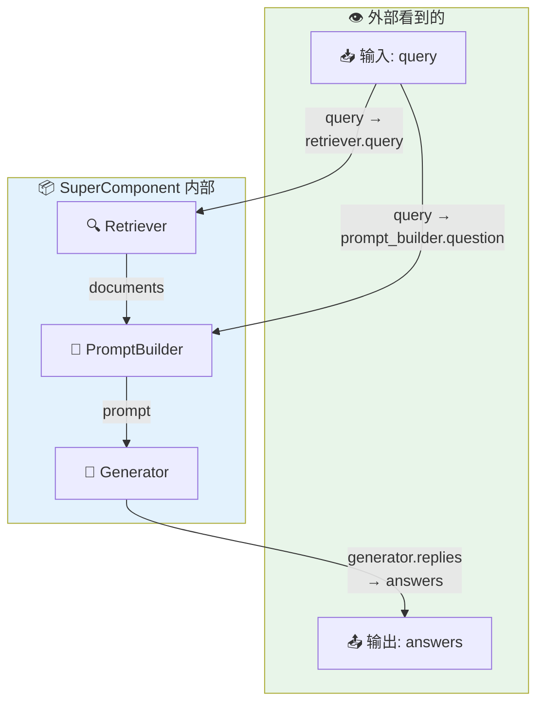
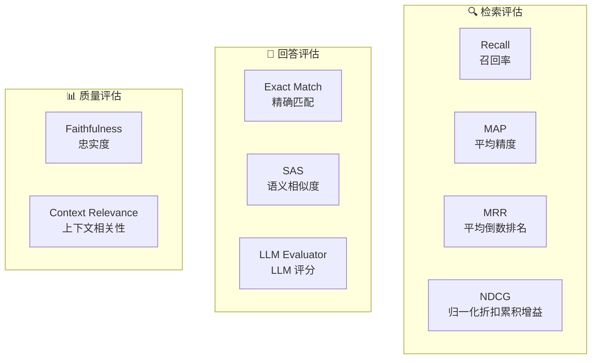
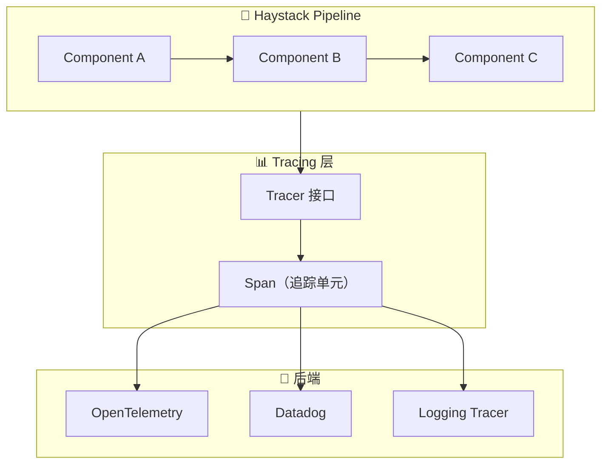
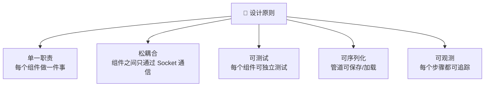
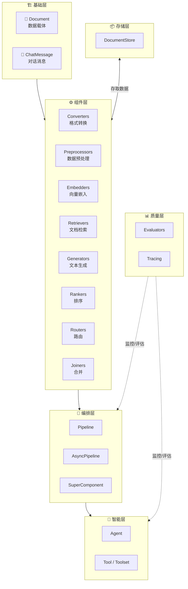

# 🏗️ 第10章：高级主题

> 掌握 SuperComponent、评估框架和可观测性，构建生产级 AI 应用

## 📌 本章目标

- 理解 SuperComponent 的设计理念和使用方式
- 掌握评估框架，量化 AI 应用的质量
- 了解可观测性（Tracing）机制
- 学会生产环境的最佳实践

---

## 10.1 SuperComponent —— 可复用的管道封装

### 10.1.1 为什么需要 SuperComponent？

当你构建了一个复杂的管道后，你可能想在其他管道中复用它。但 Pipeline 本身不能作为 Component 使用。**SuperComponent** 解决了这个问题。

### 🎁 礼品盒类比

```
想象你做了一个复杂的礼品套装：

  🎀 缎带 + 📦 盒子 + 🧸 玩具 + 📝 贺卡 = 一整个礼品套装

SuperComponent 就像把整个套装装进一个更大的盒子：
  外面看是一个盒子（Component）
  里面其实是多个组件（Pipeline）

好处：
  ✅ 简化接口：外部只需知道"输入什么、输出什么"
  ✅ 可复用：当作一个积木在其他管道中使用
  ✅ 封装细节：内部实现可以随时修改
```

### 10.1.2 基本用法

```python
from haystack import Pipeline, SuperComponent
from haystack.document_stores.in_memory import InMemoryDocumentStore
from haystack.components.retrievers.in_memory import InMemoryBM25Retriever
from haystack.components.builders import ChatPromptBuilder
from haystack.components.generators.chat import OpenAIChatGenerator
from haystack.dataclasses import ChatMessage

# === 构建内部管道 ===
store = InMemoryDocumentStore()
internal_pipeline = Pipeline()
internal_pipeline.add_component("retriever", InMemoryBM25Retriever(document_store=store))
internal_pipeline.add_component("prompt_builder", ChatPromptBuilder())
internal_pipeline.add_component("generator", OpenAIChatGenerator(model="gpt-4"))

internal_pipeline.connect("retriever.documents", "prompt_builder.documents")
internal_pipeline.connect("prompt_builder.prompt", "generator.messages")

# === 用 SuperComponent 封装 ===
rag_component = SuperComponent(
    pipeline=internal_pipeline,
    # 输入映射：外部输入 → 内部组件的输入
    input_mapping={
        "query": ["retriever.query", "prompt_builder.question"],
    },
    # 输出映射：内部组件的输出 → 外部输出
    output_mapping={
        "generator.replies": "answers",
    }
)

# === 像普通组件一样使用 ===
result = rag_component.run(query="什么是 Haystack？")
print(result["answers"])
```

### 输入输出映射图



### 10.1.3 使用 `@super_component` 装饰器

```python
from haystack import Pipeline, super_component

@super_component
class RAGSearch:
    """封装的 RAG 搜索组件"""
    
    def __init__(self, document_store, model="gpt-4"):
        # 构建内部管道
        self.pipeline = Pipeline()
        self.pipeline.add_component(
            "retriever", InMemoryBM25Retriever(document_store=document_store)
        )
        self.pipeline.add_component(
            "prompt_builder", ChatPromptBuilder()
        )
        self.pipeline.add_component(
            "generator", OpenAIChatGenerator(model=model)
        )
        
        self.pipeline.connect("retriever.documents", "prompt_builder.documents")
        self.pipeline.connect("prompt_builder.prompt", "generator.messages")
        
        # 定义映射
        self.input_mapping = {
            "query": ["retriever.query", "prompt_builder.question"]
        }
        self.output_mapping = {
            "generator.replies": "answers"
        }

# 使用
rag = RAGSearch(document_store=store, model="gpt-4")
# 可以像普通组件一样添加到其他管道中
```

### 10.1.4 SuperComponent 的优势

| 优势 | 说明 |
|------|------|
| **封装** | 隐藏内部复杂性，暴露简洁接口 |
| **复用** | 在不同管道中重复使用 |
| **嵌套** | SuperComponent 可以嵌套（SuperComponent 里包含 SuperComponent） |
| **序列化** | 支持完整的 `to_dict()` / `from_dict()` |
| **可视化** | 在管道图中以不同颜色标识 |

---

## 10.2 评估框架

### 10.2.1 为什么需要评估？

构建 AI 应用不仅仅是"能用就行"，你还需要回答：

```
❓ 检索的文档相关吗？ → 检索质量评估
❓ 生成的回答准确吗？ → 回答质量评估
❓ 回答忠于原始文档吗？ → 忠实度评估
❓ 修改后效果提升了吗？ → A/B 比较评估
```

### 🏫 考试评分类比

```
评估 AI 应用就像给学生评分：

  📝 考试题 = 测试问题集
  ✍️ 学生答案 = AI 生成的回答
  📖 标准答案 = 人工标注的正确答案
  📊 分数 = 评估指标

不同科目有不同的评分标准：
  🔍 检索评估：看学生是否找到了正确的参考资料
  💬 回答评估：看学生的回答是否正确
  📚 忠实度评估：看学生是否只基于参考资料回答
```

### 10.2.2 评估指标总览



### 10.2.3 检索评估

#### 召回率（Recall）

```python
from haystack.components.evaluators import DocumentRecallEvaluator

recall_evaluator = DocumentRecallEvaluator()

# 评估检索结果
result = recall_evaluator.run(
    ground_truth_documents=[              # 标准答案：应该检索到的文档
        [doc_a, doc_b],                    # 问题1的正确文档
        [doc_c],                           # 问题2的正确文档
    ],
    retrieved_documents=[                  # 实际检索到的文档
        [doc_a, doc_x, doc_b],             # 问题1检索到的
        [doc_y, doc_c],                    # 问题2检索到的
    ]
)

print(f"平均召回率: {result['score']}")
# 问题1: 2/2 = 1.0 (找到了 a 和 b)
# 问题2: 1/1 = 1.0 (找到了 c)
# 平均: 1.0
```

#### 各指标解释

| 指标 | 通俗解释 | 公式直觉 |
|------|----------|----------|
| **Recall** | "该找到的都找到了吗？" | 找到的正确文档 / 所有正确文档 |
| **MAP** | "正确文档的排名靠前吗？" | 正确文档排名越靠前分数越高 |
| **MRR** | "第一个正确结果排第几？" | 第一个正确结果的排名倒数 |
| **NDCG** | "整体排名质量如何？" | 综合考虑排名和相关性 |

### 10.2.4 回答评估

#### 精确匹配

```python
from haystack.components.evaluators import AnswerExactMatchEvaluator

exact_match = AnswerExactMatchEvaluator()

result = exact_match.run(
    ground_truth_answers=["Haystack 是一个 AI 框架", "Python"],
    predicted_answers=["Haystack 是一个 AI 框架", "python"]
)

print(result)
# {"individual_scores": [1, 0], "score": 0.5}
# 第一个完全匹配，第二个大小写不同
```

#### LLM 评估（最灵活）

```python
from haystack.components.evaluators import LLMEvaluator

llm_evaluator = LLMEvaluator(
    instructions="请评估回答的质量，1分表示差，5分表示优秀。",
    inputs=[("predicted_answers", list[str])],
    outputs=["score"],
    examples=[
        {
            "inputs": {"predicted_answers": "详细准确的回答"},
            "outputs": {"score": 5}
        },
        {
            "inputs": {"predicted_answers": "完全不相关的回答"},
            "outputs": {"score": 1}
        }
    ]
)
```

### 10.2.5 评估结果分析

```python
from haystack.evaluation import EvaluationRunResult

# 创建评估结果对象
eval_result = EvaluationRunResult(
    run_name="v1.0",
    inputs={"questions": ["Q1", "Q2", "Q3"]},
    results={
        "recall": {"score": 0.85, "individual_scores": [1.0, 0.7, 0.85]},
        "exact_match": {"score": 0.67, "individual_scores": [1, 0, 1]},
    }
)

# 查看汇总报告
report = eval_result.aggregated_report(output_format="json")
print(report)

# 查看详细报告
detailed = eval_result.detailed_report(output_format="df")

# 比较两次评估
comparison = eval_result.comparative_detailed_report(other_eval_result)
```

---

## 10.3 可观测性（Tracing）

### 10.3.1 为什么需要可观测性？

生产环境中，你需要知道：

```
❓ 管道每一步花了多长时间？ → 性能优化
❓ LLM 实际收到的 Prompt 是什么？ → 调试
❓ 哪个组件经常出错？ → 稳定性监控
❓ 每次请求消耗了多少 Token？ → 成本管理
```

### 10.3.2 Haystack 的 Tracing 架构



### 10.3.3 使用 Tracing

```python
from haystack import tracing

# 方式一：使用 OpenTelemetry
from haystack.tracing.opentelemetry import OpenTelemetryTracer

tracer = OpenTelemetryTracer(
    tracer=opentelemetry.trace.get_tracer("haystack")
)
tracing.enable_tracing(tracer)

# 方式二：使用简单的日志追踪
from haystack.tracing.logging_tracer import LoggingTracer

tracer = LoggingTracer()
tracing.enable_tracing(tracer)
```

### 10.3.4 Tracing 的核心概念

| 概念 | 说明 | 类比 |
|------|------|------|
| **Trace** | 一次完整的管道执行 | 一次快递运送 |
| **Span** | 一个组件的执行过程 | 运送中的一个站点 |
| **Tag** | Span 上的标签信息 | 站点的处理记录 |
| **Content Tag** | 敏感内容标签（可开关） | 包裹内容详情 |

### 追踪示例

```mermaid
gantt
    title Pipeline 执行追踪
    dateFormat X
    axisFormat %s秒
    
    section RAG Pipeline
    TextEmbedder     :0, 200
    Retriever        :200, 100
    PromptBuilder    :300, 50
    ChatGenerator    :350, 1500
```



```python
# 开启内容追踪（默认关闭以保护隐私）
import os
os.environ["HAYSTACK_CONTENT_TRACING_ENABLED"] = "true"

# 现在 Tracer 会记录查询内容、文档内容、LLM 回复等
```

---

## 10.4 生产环境最佳实践

### 10.4.1 管道设计原则



### 10.4.2 错误处理

```python
from haystack.core.errors import PipelineRuntimeError

try:
    result = pipeline.run(data)
except PipelineRuntimeError as e:
    # 包含出错的组件名和详细信息
    print(f"组件 '{e.component_name}' 执行失败: {e}")
except Exception as e:
    print(f"未预期的错误: {e}")
```

### 10.4.3 密钥管理

```python
from haystack.utils.auth import Secret

# ✅ 推荐：从环境变量读取
generator = OpenAIChatGenerator(
    api_key=Secret.from_env_var("OPENAI_API_KEY")
)

# ❌ 不推荐：硬编码
generator = OpenAIChatGenerator(
    api_key="sk-..."  # 永远不要这样做！
)
```

### 10.4.4 性能优化检查清单

| 优化项 | 建议 |
|--------|------|
| **嵌入模型** | 选择合适维度的模型（384 vs 768 vs 1536） |
| **批处理** | 索引时使用批量嵌入 |
| **缓存** | 对频繁的查询使用缓存组件 |
| **异步** | 高并发场景使用 AsyncPipeline |
| **分块大小** | 测试不同的 split_length 找到最优值 |
| **Top-K** | 根据需要调整检索数量，不要取太多 |

### 10.4.5 项目结构建议

```
my_ai_project/
├── pipelines/
│   ├── indexing.py          # 索引管道
│   ├── querying.py          # 查询管道
│   └── evaluation.py        # 评估管道
├── components/
│   └── custom_component.py  # 自定义组件
├── tools/
│   └── custom_tools.py      # Agent 工具
├── configs/
│   ├── indexing.yaml         # 管道配置
│   └── querying.yaml
├── data/
│   └── evaluation_set.json   # 评估数据集
├── tests/
│   ├── test_components.py
│   └── test_pipelines.py
└── main.py
```

---

## 10.5 总结：Haystack 知识地图



---

## 10.6 学习路线回顾

恭喜你完成了 Haystack 的全部教程！让我们回顾一下学习路线：

| 章节 | 掌握的技能 | 能构建的应用 |
|------|-----------|-------------|
| 第1-2章 | 基础概念 | 理解框架架构 |
| 第3章 | Document 模型 | 数据管理 |
| 第4章 | Component 系统 | 自定义组件 |
| 第5章 | Pipeline 编排 | 数据处理流程 |
| 第6章 | 数据处理 | 文档索引系统 |
| 第7章 | 嵌入与检索 | 语义搜索引擎 |
| 第8章 | LLM 生成 | RAG 问答系统 |
| 第9章 | Agent 与 Tool | 智能助手 |
| 第10章 | 高级主题 | 生产级应用 |

---

## 📚 进阶资源

| 资源 | 链接 | 说明 |
|------|------|------|
| 📖 官方文档 | [docs.haystack.deepset.ai](https://docs.haystack.deepset.ai/) | 最新 API 文档 |
| 🐙 GitHub | [github.com/deepset-ai/haystack](https://github.com/deepset-ai/haystack) | 源代码 |
| 💬 Discord | [discord.gg/haystack](https://discord.gg/haystack) | 社区交流 |
| 📝 Tutorials | [haystack.deepset.ai/tutorials](https://haystack.deepset.ai/tutorials) | 官方教程 |
| 🔌 Integrations | [haystack.deepset.ai/integrations](https://haystack.deepset.ai/integrations) | 集成列表 |

---

## 🎉 结语

Haystack 是一个强大而灵活的框架，它的核心理念——**模块化、声明式、厂商无关**——使得构建 AI 应用变得简单而高效。

无论你是想构建一个简单的问答系统，还是一个复杂的多 Agent 协作系统，Haystack 都能提供你需要的工具和抽象。

**记住**：最好的学习方式是动手实践。选择一个实际项目，用 Haystack 来构建它吧！🚀

---

[👈 返回目录](./README.md)
