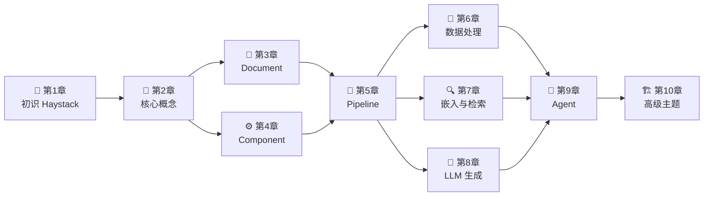

# 📚 Haystack 深度学习教程

> 🎯 由浅入深，带你全面掌握 Haystack —— 开源 AI 应用编排框架

## 🌟 Haystack 是什么？

**Haystack** 是由 [deepset](https://www.deepset.ai/) 开发的开源 AI 编排框架，专为构建**生产级 LLM 应用**而设计。你可以用它来构建：

- 🔍 **RAG（检索增强生成）系统** —— 让 LLM 基于你的私有数据回答问题
- 🤖 **AI Agent** —— 能够自主调用工具、完成复杂任务的智能体
- 📝 **语义搜索** —— 基于语义理解的智能搜索引擎
- 🎯 **多模态应用** —— 处理文本、图片、音频等多种数据

## 📖 教程目录

| 章节 | 标题 | 内容概要 | 难度 |
|------|------|----------|------|
| [第1章](./01-introduction.md) | 🚀 初识 Haystack | 框架概述、设计哲学、安装配置 | ⭐ |
| [第2章](./02-core-concepts.md) | 🧩 核心概念总览 | 架构全景图、核心抽象概念 | ⭐ |
| [第3章](./03-document.md) | 📄 Document —— 数据的载体 | 文档模型、元数据、序列化 | ⭐⭐ |
| [第4章](./04-component.md) | ⚙️ Component —— 功能的积木 | 组件系统、生命周期、自定义组件 | ⭐⭐ |
| [第5章](./05-pipeline.md) | 🔗 Pipeline —— 编排的引擎 | 管道系统、连接方式、执行原理 | ⭐⭐⭐ |
| [第6章](./06-converters-preprocessors.md) | 🔄 数据处理组件 | 文件转换、文本清洗、文档切分 | ⭐⭐ |
| [第7章](./07-embedders-retrievers.md) | 🔍 嵌入与检索 | 向量嵌入、语义搜索、BM25 | ⭐⭐⭐ |
| [第8章](./08-generators-chat.md) | 💬 LLM 生成与对话 | 文本生成、对话系统、流式输出 | ⭐⭐⭐ |
| [第9章](./09-agents-tools.md) | 🤖 Agent 与 Tool | 智能体、工具调用、自主推理 | ⭐⭐⭐⭐ |
| [第10章](./10-advanced.md) | 🏗️ 高级主题 | SuperComponent、评估、可观测性 | ⭐⭐⭐⭐ |

## 🗺️ 学习路线图



## 📋 阅读建议

### 🟢 初学者路线
> 如果你是第一次接触 Haystack，推荐按顺序阅读第 1~5 章

### 🟡 实践者路线
> 如果你想快速构建应用，可以在阅读前 5 章后，直接跳到感兴趣的章节

### 🔴 进阶者路线
> 如果你已有 Haystack 基础，可以直接查看第 9~10 章的高级主题

## 🛠️ 环境准备

```bash
# 安装 Haystack
pip install haystack-ai

# 验证安装
python -c "import haystack; print(haystack.__version__)"
```

## 📌 约定说明

- 📝 文中的代码示例均可独立运行（除需要 API Key 的部分）
- 🔗 专业术语首次出现时会提供中英文对照
- 💡 「小贴士」提供实用的技巧和最佳实践
- ⚠️ 「注意」标记常见陷阱和注意事项
- 🎨 使用 Mermaid 图表辅助理解架构和流程

---

> 💡 **提示**：本教程基于 Haystack 2.x 版本编写。Haystack 2.x 是对 1.x 的完全重写，架构更加清晰和灵活。

> 📖 **官方文档**：[https://docs.haystack.deepset.ai/](https://docs.haystack.deepset.ai/)

> 🐙 **GitHub**：[https://github.com/deepset-ai/haystack](https://github.com/deepset-ai/haystack)
